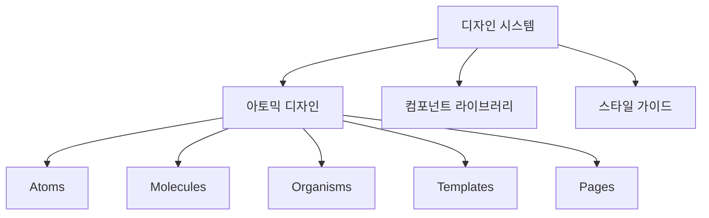
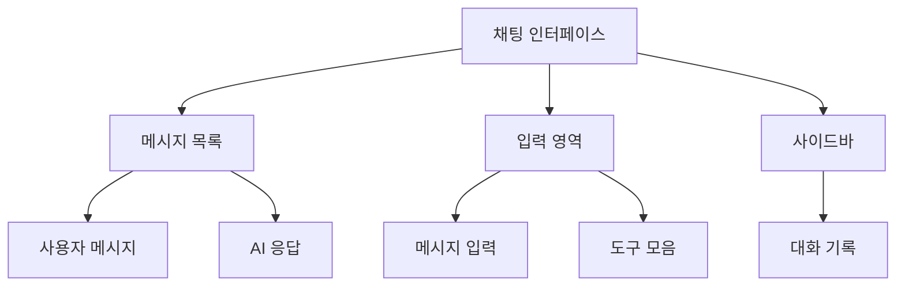
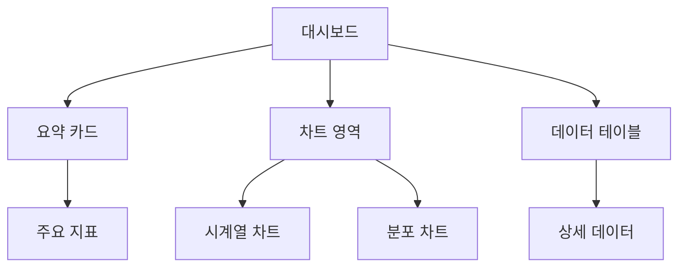
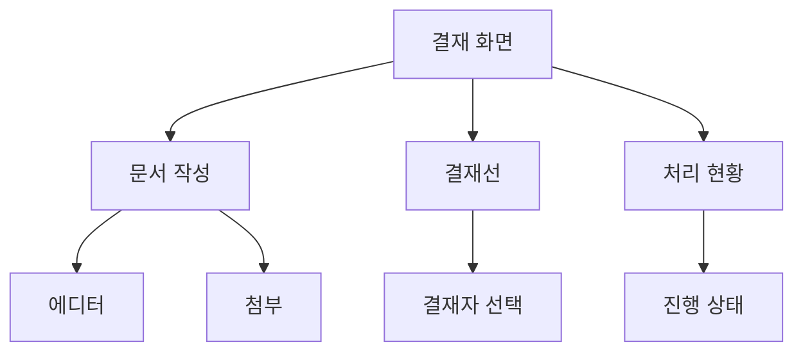

# 사용자 인터페이스 설계

## 1. 공통 UI/UX 원칙

### 1.1 디자인 시스템


#### 컴포넌트 구조
- **Atoms**: 버튼, 입력 필드, 라벨 등 기본 요소
- **Molecules**: 검색 폼, 메뉴 아이템 등 기본 요소의 조합
- **Organisms**: 헤더, 폼, 카드 목록 등 복잡한 컴포넌트
- **Templates**: 페이지 레이아웃
- **Pages**: 실제 콘텐츠가 적용된 페이지

### 1.2 레이아웃 시스템
- **그리드 시스템**
  - 12컬럼 그리드
  - 반응형 브레이크포인트
  - 유동적 레이아웃
- **여백 시스템**
  - 8px 기준 스케일
  - 일관된 여백 적용
  - 계층적 구조 표현

### 1.3 색상 시스템
- **주요 색상**
  - Primary: #0066FF
  - Secondary: #6B7280
  - Accent: #00CC99
- **상태 색상**
  - Success: #10B981
  - Warning: #F59E0B
  - Error: #EF4444
- **중립 색상**
  - 배경: #FFFFFF, #F9FAFB
  - 텍스트: #111827, #374151, #6B7280

## 2. 서비스별 UI 설계

### 2.1 AI 챗봇 인터페이스

#### 메인 화면 레이아웃


#### 주요 기능
- 실시간 메시지 표시
- 컨텍스트 유지
- 멀티모달 입력 지원
- 대화 내역 관리

### 2.2 예산 분석 대시보드

#### 메인 대시보드 구조


#### 핵심 요소
- 실시간 데이터 시각화
- 인터랙티브 차트
- 필터링 및 검색
- 맞춤형 보고서

### 2.3 전자결재 시스템

#### 문서 처리 화면


#### 주요 기능
- 드래그 앤 드롭
- 실시간 협업
- 문서 미리보기
- 모바일 대응

## 3. 반응형 설계

### 3.1 브레이크포인트
- **Mobile**: < 640px
- **Tablet**: 641px - 1024px
- **Desktop**: > 1024px
- **Large Desktop**: > 1280px

### 3.2 레이아웃 변화
```css
// 예시 코드
.container {
  /* Mobile */
  width: 100%;
  padding: 1rem;

  /* Tablet */
  @media (min-width: 641px) {
    max-width: 768px;
    padding: 2rem;
  }

  /* Desktop */
  @media (min-width: 1024px) {
    max-width: 1024px;
    padding: 2.5rem;
  }
}
```

## 4. 접근성 고려사항

### 4.1 WCAG 2.1 준수
- **인식의 용이성**
  - 적절한 대체 텍스트
  - 충분한 색상 대비
  - 리사이즈 지원
- **운용의 용이성**
  - 키보드 접근성
  - 충분한 시간 제공
  - 탐색 용이성
- **이해의 용이성**
  - 일관된 탐색
  - 오류 식별
  - 입력 도움

### 4.2 스크린리더 지원
```html
<!-- 예시 코드 -->
<button 
  aria-label="결재 승인"
  role="button"
  aria-pressed="false"
>
  <span class="icon">✓</span>
  <span class="text">승인</span>
</button>
```

## 5. 성능 최적화

### 5.1 로딩 전략
- **레이지 로딩**
  - 이미지 지연 로딩
  - 컴포넌트 동적 임포트
  - 무한 스크롤

### 5.2 상태 관리
```typescript
// 예시 코드
interface UIState {
  theme: 'light' | 'dark';
  sidebar: boolean;
  modal: {
    isOpen: boolean;
    content: string;
  };
}

const useUIStore = create<UIState>((set) => ({
  theme: 'light',
  sidebar: true,
  modal: {
    isOpen: false,
    content: '',
  },
  toggleTheme: () => 
    set((state) => ({ 
      theme: state.theme === 'light' ? 'dark' : 'light' 
    })),
}));
```

## 6. 테스트 전략

### 6.1 UI 테스트
- 컴포넌트 단위 테스트
- 통합 테스트
- E2E 테스트
- 크로스 브라우저 테스트

### 6.2 사용성 테스트
- 사용자 테스트
- A/B 테스트
- 히트맵 분석
- 사용자 피드백 수집 

## 7. 화면 설계

### 7.1 공통 레이아웃
```
+------------------------------------------+
|  로고     메인메뉴    알림  프로필       |
+------------------------------------------+
|        |                                 |
| 사이드 |           컨텐츠 영역           |
|  메뉴  |                                 |
|        |                                 |
+------------------------------------------+
|              푸터 영역                    |
+------------------------------------------+
```

### 7.2 AI 챗봇 인터페이스
```
+------------------------------------------+
| 새대화  저장된 대화                      |
+------------------------------------------+
|        |                                 |
| 대화   |  AI: 안녕하세요. 무엇을 도와   |
| 목록   |      드릴까요?                  |
|        |                                 |
|        |  User: 예산 분석 부탁해요       |
|        |                                 |
|        |  AI: 어떤 기간의 예산을        |
|        |      분석하시겠습니까?         |
|        |                                 |
|        +--------------------------------+
|        | 메시지 입력                  ▶  |
+------------------------------------------+
```

### 7.3 예산 분석 대시보드
```
+------------------------------------------+
| 기간 선택  필터  검색                    |
+------------------------------------------+
| +---------+ +---------+ +---------+      |
| | 총 예산  | | 집행률  | | 잔액    |      |
| | 1.5억원  | | 65%    | | 5250만원 |      |
| +---------+ +---------+ +---------+      |
|                                          |
| +------------------+ +------------------+ |
| |   예산 추이      | |   카테고리별     | |
| |   (시계열 차트)  | |   (파이 차트)    | |
| |                  | |                  | |
| +------------------+ +------------------+ |
|                                          |
| +--------------------------------------+ |
| |          상세 내역 테이블            | |
| |                                      | |
| +--------------------------------------+ |
+------------------------------------------+
```

### 7.4 전자결재 화면
```
+------------------------------------------+
| 문서 작성  결재함  완료함                |
+------------------------------------------+
| +----------------+ +-------------------+  |
| | 결재 대기(5)   | | 문서 제목        |  |
| | 결재 예정(2)   | | 기안자: 홍길동   |  |
| | 완료함         | | 기안일: 2024.3.1 |  |
| |                | |                   |  |
| |                | | [문서 내용]       |  |
| |                | |                   |  |
| |                | |                   |  |
| |                | |                   |  |
| |                | +-------------------+  |
| |                | | 승인 | 반려 | 검토 | |
| +----------------+ +-------------------+  |
+------------------------------------------+
```

### 7.5 법규준수 모니터링
```
+------------------------------------------+
| 대시보드  규정목록  점검현황  리포트     |
+------------------------------------------+
| +----------------+ +-------------------+  |
| | 준수율         | | 최근 업데이트    |  |
| | [게이지 차트]  | | - 금융법 개정    |  |
| |                | | - 내부통제 강화  |  |
| +----------------+ +-------------------+  |
|                                          |
| +--------------------------------------+ |
| |          규정 준수 현황              | |
| | [테이블]                             | |
| | 분야 | 준수항목 | 상태 | 조치필요   | |
| |                                      | |
| +--------------------------------------+ |
+------------------------------------------+
```

### 7.6 모바일 반응형 레이아웃
```
+------------------+     +------------------+
| 메뉴             |     | < 뒤로가기      |
+------------------+     +------------------+
| +--------------+ |     |                 |
| |  대시보드    | |     |    컨텐츠      |
| +--------------+ |     |     영역       |
| |  결재함      | |     |                |
| +--------------+ |     |                |
| |  보고서      | |     |                |
| +--------------+ |     |                |
|                  |     |                |
+------------------+     +------------------+
```

### 7.7 공통 컴포넌트

#### 7.7.1 버튼 스타일
```
[ 기본 버튼 ]  [✓ 성공]  [⚠ 경고]  [✕ 오류]
```

#### 7.7.2 입력 필드
```
+------------------------------------------+
| 레이블                                    |
| +--------------------------------------+ |
| |              입력 영역               | |
| +--------------------------------------+ |
| 도움말 텍스트                           |
+------------------------------------------+
```

#### 7.7.3 알림 메시지
```
+------------------------------------------+
| ℹ️ 정보 알림                             |
+------------------------------------------+
| ✓ 성공 알림                              |
+------------------------------------------+
| ⚠ 경고 알림                              |
+------------------------------------------+
| ✕ 오류 알림                              |
+------------------------------------------+
```

### 7.8 데이터 시각화 컴포넌트

#### 7.8.1 차트 레이아웃
```
+------------------------------------------+
| 차트 제목                 필터 옵션 ▼    |
+------------------------------------------+
|                                          |
|                                          |
|          차트 표시 영역                  |
|                                          |
|                                          |
+------------------------------------------+
| 범례:  시리즈1 ● 시리즈2 ● 시리즈3 ●   |
+------------------------------------------+
```

#### 7.8.2 데이터 테이블
```
+------------------------------------------+
| 검색                    필터   내보내기  |
+------------------------------------------+
| □ | 항목명 | 상태 | 날짜 | 담당자 | 액션 |
|---+--------+------+------+--------+------|
| □ | 항목 1 | 완료 | 3/1  | 홍길동 | ••• |
| □ | 항목 2 | 대기 | 3/2  | 김철수 | ••• |
+------------------------------------------+
| < 1 2 3 ... 10 >   페이지당 항목 수 ▼   |
+------------------------------------------+
```