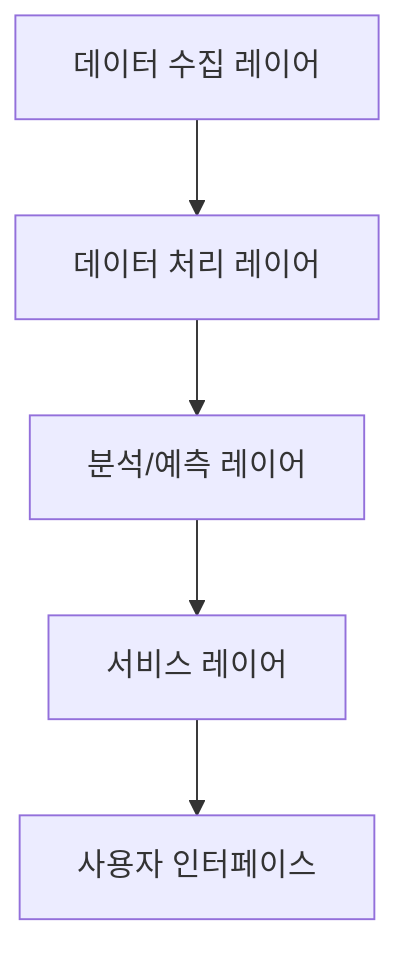
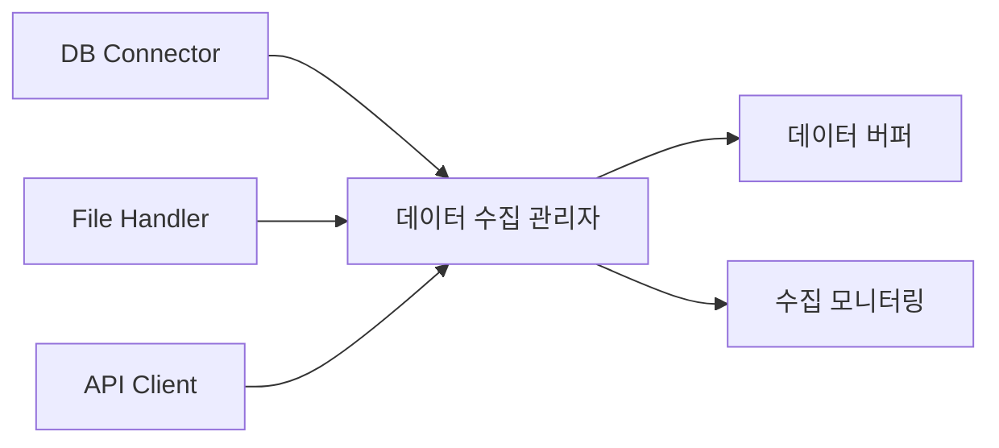
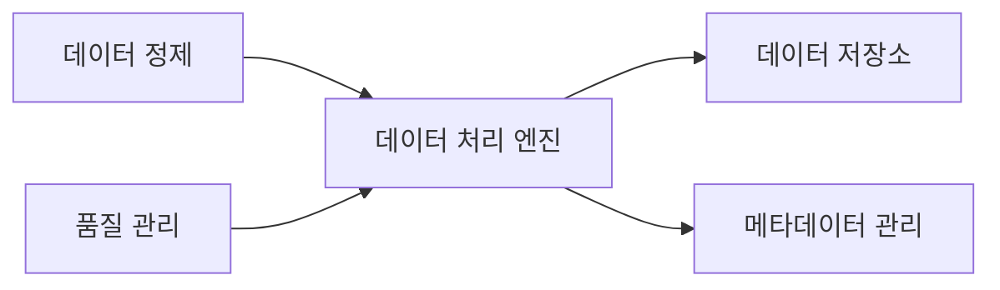
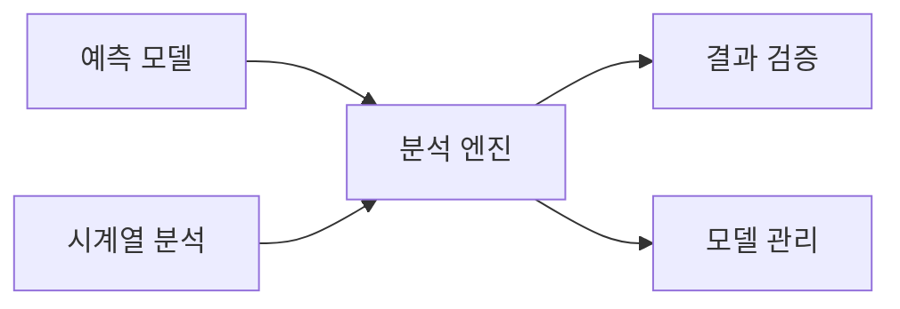
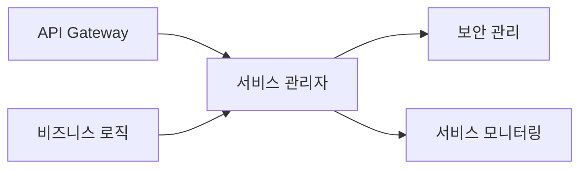

# 예산 분석 및 예측 AI 시스템 설계

## 1. 시스템 아키텍처

### 1.1 전체 구조

### 1.2 레이어별 주요 기능

#### 데이터 수집 레이어
- 다양한 소스의 데이터를 통합 수집
- 실시간/배치 데이터 수집 프로세스 관리
- 데이터 수집 모니터링 및 오류 처리

#### 데이터 처리 레이어
- ETL 프로세스 실행
- 데이터 정제 및 표준화
- 품질 검증 및 보정

#### 분석/예측 레이어
- 머신러닝 기반 예측 모델 운영
- 실시간 분석 처리
- 결과 정확도 검증

#### 서비스 레이어
- API 서비스 제공
- 비즈니스 로직 처리
- 보안 및 인증 관리

#### 사용자 인터페이스
- 웹 기반 대시보드
- 모바일 지원
- 실시간 알림

## 2. 상세 컴포넌트 설계

### 2.1 데이터 수집 레이어

#### 핵심 컴포넌트
1. **데이터 커넥터 모듈**
   - DB 연결 관리
     - 관계형 DB: MariaDB, Oracle, MSSQL
     - NoSQL: MongoDB, Redis
   - 파일 처리 (CSV, Excel, JSON)
   - API 통신 (REST, GraphQL)
   - 실시간 스트리밍 처리

2. **수집 스케줄러**
   - 정기 수집 작업 관리
   - 수집 이력 추적
   - 오류 복구 메커니즘

### 2.2 데이터 처리 레이어

#### 주요 프로세스
1. **전처리 파이프라인**
   - 데이터 정규화
   - 결측치/이상치 처리
   - 자동 분류 및 태깅

2. **품질 관리 시스템**
   - 데이터 검증 규칙 실행
   - 품질 지표 모니터링
   - 자동 보정 프로세스

### 2.3 분석/예측 레이어

#### 분석 컴포넌트
1. **예측 모델링**
   - 모델 학습 파이프라인
   - 하이퍼파라미터 최적화
   - 모델 버전 관리
   - 앙상블 예측

2. **분석 엔진**
   - 패턴 분석
   - 이상 감지
   - 비교 분석

### 2.4 서비스 레이어

#### 서비스 컴포넌트
1. **API 서비스**
   - RESTful API 제공
   - 요청/응답 처리
   - 서비스 버전 관리

2. **보안 관리**
   - 인증/인가 처리
   - 데이터 암호화
   - 접근 제어

## 3. 기술 스택

### 3.1 백엔드
- **언어**: Python 3.11+
- **프레임워크**: 
  - FastAPI 0.100+
  - LangChain 0.1.0+
- **데이터베이스**: 
  - 관계형: MariaDB 10.11+ (기본)
    - Oracle 21c+ (선택)
    - MSSQL 2022+ (선택)
  - 벡터 DB: Chroma
- **캐시**: Redis 7.2+
- **메시징**: Apache Kafka 3.6+

### 3.2 AI/ML
- **LLM 통합**:
  - LangChain
  - LlamaIndex
  - OpenAI GPT-4
- **예측 모델링**:
  - PyTorch 2.1+
  - Scikit-learn 1.3+
  - Prophet
- **RAG 구현**:
  - LangChain RAG
  - Vector Store: Chroma
  - Hybrid Search
- **시계열 분석**: 
  - Darts
  - NeuralProphet

### 3.3 프론트엔드
- **프레임워크**: Next.js 14+
- **상태관리**: Zustand
- **차트**: TanStack Chart
- **UI**: Shadcn/ui
- **스타일링**: Tailwind CSS

## 4. 보안 설계

### 4.1 데이터 보안
- AES-256 암호화
- 데이터 마스킹
- 접근 로깅

### 4.2 시스템 보안
- JWT 기반 인증
- RBAC 접근 제어
- SSL/TLS 적용

## 5. 확장성 설계

### 5.1 시스템 확장성
- 마이크로서비스 아키텍처
- 컨테이너 기반 배포 (Docker/K8s)
- 수평적 확장 지원

### 5.2 데이터 확장성
- 샤딩 전략
- 데이터 파티셔닝
- 분산 저장소 활용
