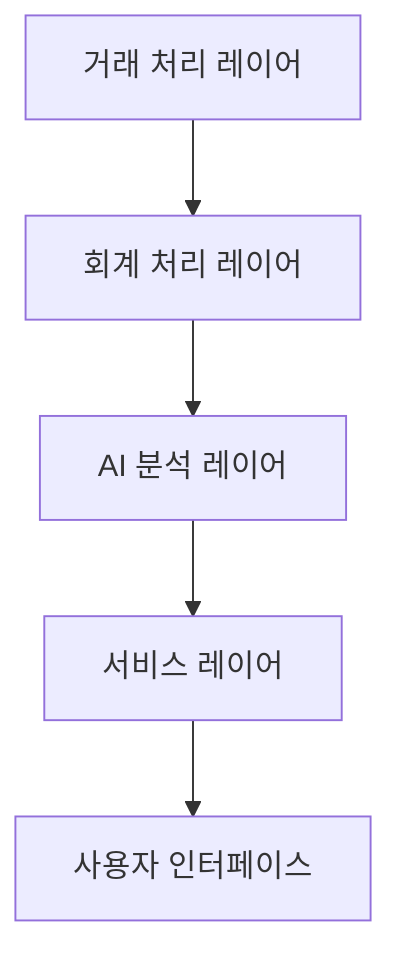
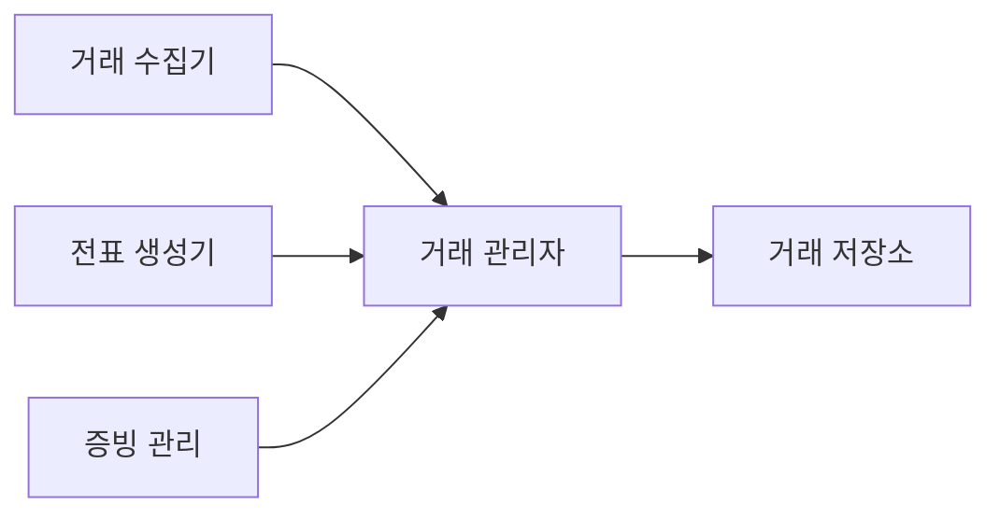
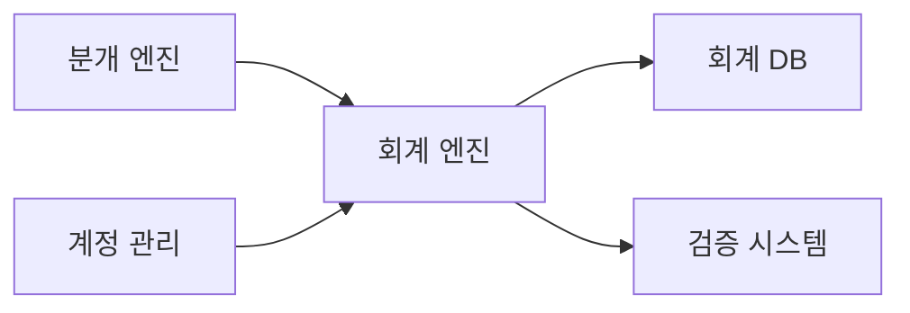
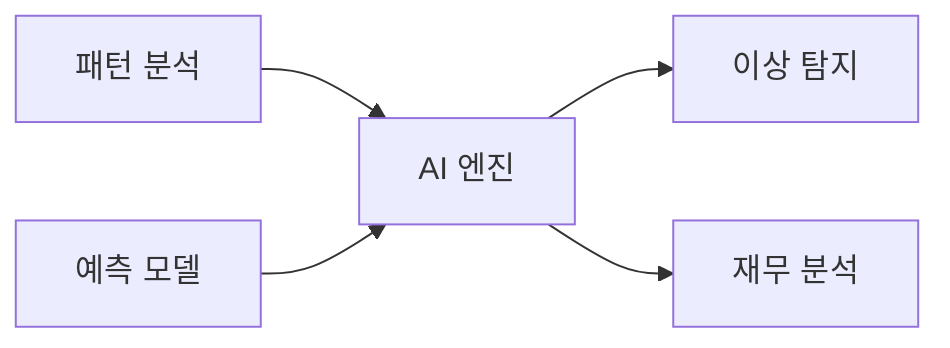

# 지능형회계 AI 시스템 설계

## 1. 시스템 아키텍처

### 1.1 전체 구조

### 1.2 레이어별 주요 기능

#### 거래 처리 레이어
- 거래 데이터 수집/관리
- 전표 자동 생성
- 증빙 문서 관리

#### 회계 처리 레이어
- 분개 자동화
- 계정 분류
- 회계 규칙 적용

#### AI 분석 레이어
- 이상 거래 탐지
- 회계 처리 자동화
- 재무 분석/예측

#### 서비스 레이어
- API 서비스
- 리포팅 서비스
- 알림 관리

## 2. 상세 컴포넌트 설계

### 2.1 거래 처리 레이어

#### 핵심 컴포넌트
1. **거래 관리 모듈**
   - 거래 데이터 수집
   - 전표 자동 생성
   - 증빙 문서 처리
   - 거래 검증

### 2.2 회계 처리 레이어

#### 주요 프로세스
1. **회계 처리 엔진**
   - 자동 분개 처리
   - 계정 코드 매핑
   - 회계 규칙 적용
   - 검증 및 조정

### 2.3 AI 분석 레이어

#### 분석 컴포넌트
1. **AI 분석 엔진**
   - 거래 패턴 학습
   - 이상 거래 탐지
   - 자동 분류 예측
   - 재무 지표 예측

## 3. 기술 스택

### 3.1 백엔드
- **언어**: Python 3.11+
- **프레임워크**: 
  - FastAPI 0.100+
  - LangChain 0.1.0+
- **데이터베이스**: 
  - 관계형: MariaDB 10.11+ (기본)
    - Oracle 21c+ (선택)
    - MSSQL 2022+ (선택)
  - 벡터 DB: Weaviate
- **캐시**: Redis 7.2+
- **메시징**: RabbitMQ 3.12+

### 3.2 AI/ML
- **LLM 통합**:
  - LangChain
  - OpenAI GPT-4
  - Claude 3
- **문서 처리**:
  - Unstructured
  - LangChain Document Loaders
- **RAG 구현**:
  - LangChain RAG
  - Vector Store: Weaviate
  - Semantic Search
- **이상 탐지**: 
  - Isolation Forest
  - LSTM with PyTorch 2.1+

### 3.3 프론트엔드
- **프레임워크**: Next.js 14+
- **상태관리**: Jotai
- **차트**: Tremor
- **UI**: Shadcn/ui
- **스타일링**: Tailwind CSS

## 4. 보안 설계

### 4.1 데이터 보안
- 거래 데이터 암호화
- 감사 추적
- 접근 통제

### 4.2 시스템 보안
- 다중 인증
- 역할 기반 접근 제어
- API 보안

## 5. 확장성 설계

### 5.1 시스템 확장성
- 마이크로서비스 구조
- 컨테이너 오케스트레이션
- 서버리스 컴퓨팅

### 5.2 데이터 확장성
- 데이터 파티셔닝
- 분산 처리
- 백업/복구 자동화 