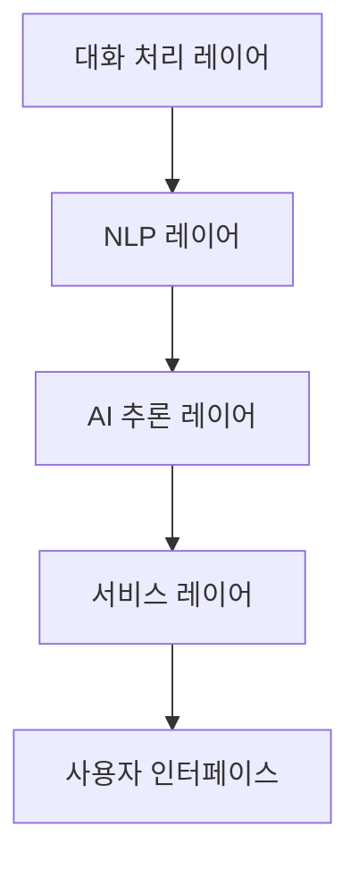
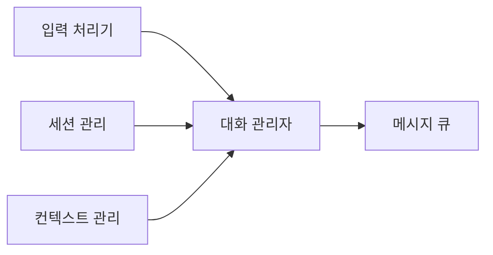
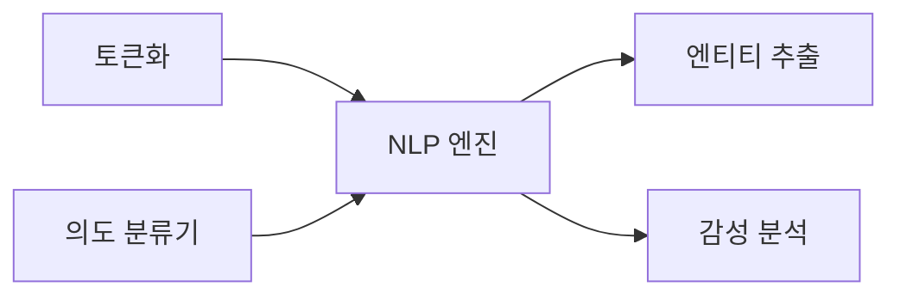
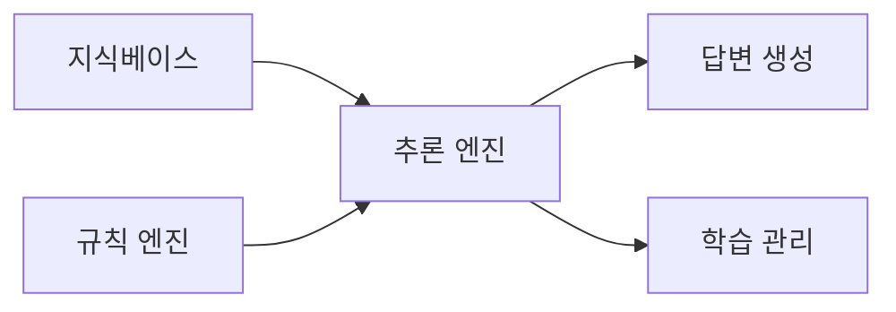

# AI 챗봇 시스템 설계

## 1. 시스템 아키텍처

### 1.1 전체 구조

### 1.2 레이어별 주요 기능

#### 대화 처리 레이어
- 사용자 입력 처리
- 대화 세션 관리
- 컨텍스트 추적

#### NLP 레이어
- 자연어 이해(NLU)
- 의도 분류
- 엔티티 추출

#### AI 추론 레이어
- 답변 생성
- 지식베이스 검색
- 대화 흐름 제어

#### 서비스 레이어
- API 서비스
- 대화 로깅
- 성능 모니터링

## 2. 상세 컴포넌트 설계

### 2.1 대화 처리 레이어

#### 핵심 컴포넌트
1. **대화 관리 모듈**
   - 입력 전처리
   - 세션 상태 관리
   - 컨텍스트 추적
   - 대화 이력 관리

### 2.2 NLP 레이어

#### 주요 프로세스
1. **언어 처리 파이프라인**
   - 형태소 분석
   - 구문 분석
   - 의미 분석
   - 감성 분석

### 2.3 AI 추론 레이어

#### 분석 컴포넌트
1. **추론 엔진**
   - 답변 후보 생성
   - 답변 순위화
   - 규칙 기반 필터링
   - 맥락 기반 응답

## 3. 기술 스택

### 3.1 백엔드
- **언어**: Python 3.11+
- **프레임워크**: 
  - FastAPI 0.100+
  - LangChain 0.1.0+
- **데이터베이스**: 
  - 관계형: MariaDB 10.11+ (기본)
    - Oracle 21c+ (선택)
    - MSSQL 2022+ (선택)
  - 벡터 DB: Chroma
- **캐시**: Redis 7.2+
- **메시징**: Apache Kafka 3.6+

### 3.2 AI/ML
- **LLM 통합**:
  - LangChain
  - LlamaIndex
  - OpenAI GPT-4
- **임베딩 모델**:
  - BERT (Hugging Face)
  - Sentence-Transformers
- **RAG 구현**:
  - LangChain RAG
  - Vector Store: Chroma
  - Retrieval: BM25, Hybrid Search
- **대화 엔진**: 
  - LangChain Agents
  - Custom Chain 구현

### 3.3 프론트엔드
- **프레임워크**: Next.js 14+
- **상태관리**: Zustand
- **UI**: Shadcn/ui
- **스타일링**: Tailwind CSS

## 4. 보안 설계

### 4.1 데이터 보안
- 대화 내용 암호화
- 개인정보 마스킹
- 접근 로깅

### 4.2 시스템 보안
- JWT 인증
- Rate Limiting
- XSS 방지

## 5. 확장성 설계

### 5.1 시스템 확장성
- 마이크로서비스 구조
- 컨테이너화
- 로드밸런싱

### 5.2 기능 확장성
- 플러그인 아키텍처
- 다국어 지원
- 채널 확장성 