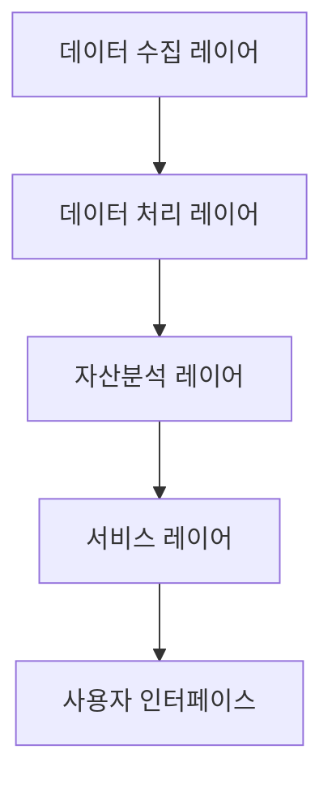
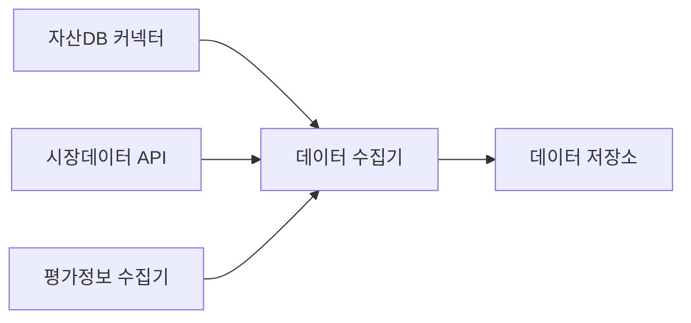
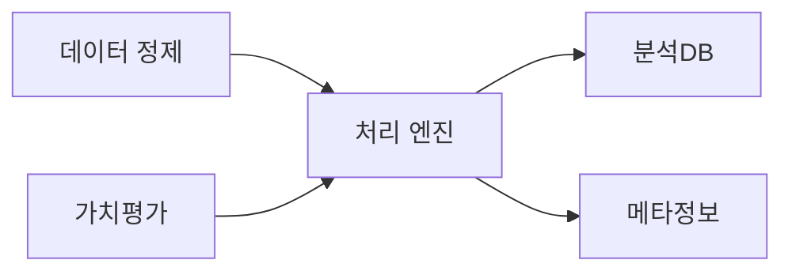
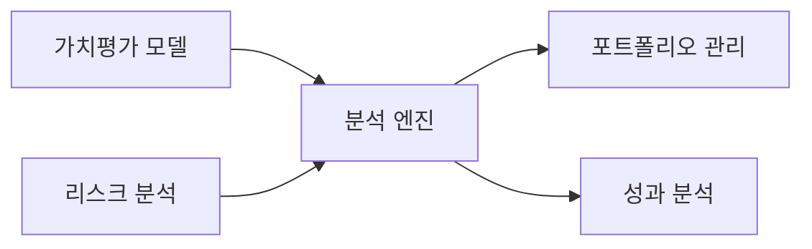

# 자산관리 AI 시스템 설계

## 1. 시스템 아키텍처

### 1.1 전체 구조

### 1.2 레이어별 주요 기능

#### 데이터 수집 레이어
- 자산 데이터 자동 수집
- 시장 데이터 실시간 수집
- 외부 평가 데이터 연동

#### 데이터 처리 레이어
- 자산 데이터 표준화
- 가치평가 데이터 정제
- 리스크 데이터 가공

#### 자산분석 레이어
- AI 기반 자산가치 평가
- 리스크 분석 엔진
- 포트폴리오 최적화

#### 서비스 레이어
- 자산관리 API 제공
- 리포트 생성 서비스
- 알림 서비스

## 2. 상세 컴포넌트 설계

### 2.1 데이터 수집 레이어

#### 핵심 컴포넌트
1. **데이터 수집 모듈**
   - 자산 정보 수집
   - 시장 데이터 연동
   - 평가 정보 수집
   - 실시간 가격 정보 수집

### 2.2 데이터 처리 레이어

#### 주요 프로세스
1. **데이터 표준화**
   - 자산 분류 체계화
   - 가치평가 기준 통일
   - 리스크 지표 산출

### 2.3 자산분석 레이어

#### 분석 컴포넌트
1. **AI 평가 모델**
   - 시장가치 예측
   - 리스크 평가
   - 최적 포트폴리오 도출

## 3. 기술 스택

### 3.1 백엔드
- **언어**: Python 3.11+
- **프레임워크**: 
  - FastAPI 0.100+
  - LangChain 0.1.0+
- **데이터베이스**: 
  - 관계형: MariaDB 10.11+, Oracle 21c+, MSSQL 2022+
  - 벡터 DB: Pinecone
- **캐시**: Redis 7.2+
- **메시징**: RabbitMQ 3.12+

### 3.2 AI/ML
- **LLM 통합**:
  - LangChain
  - OpenAI GPT-4
  - Claude 3
- **예측 모델링**:
  - PyTorch 2.1+
  - LightGBM 4.x
- **RAG 구현**:
  - LangChain RAG
  - Vector Store: Pinecone
  - Semantic Search
- **시계열 분석**: 
  - Prophet
  - StatsModels

### 3.3 프론트엔드
- **프레임워크**: Vue.js 3
- **차트**: Highcharts
- **UI**: Vuetify

## 4. 보안 설계

### 4.1 데이터 보안
- 엔드투엔드 암호화
- 민감정보 마스킹
- 접근 이력 관리

### 4.2 시스템 보안
- OAuth 2.0 인증
- RBAC 권한 관리
- API 보안

## 5. 확장성 설계

### 5.1 시스템 확장성
- 서버리스 아키텍처
- 컨테이너 오케스트레이션
- 자동 스케일링

### 5.2 데이터 확장성
- 시계열 데이터 최적화
- 콜드/핫 스토리지 분리
- 분산 처리 지원 