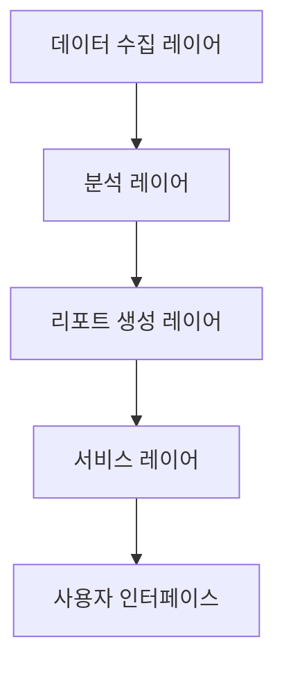
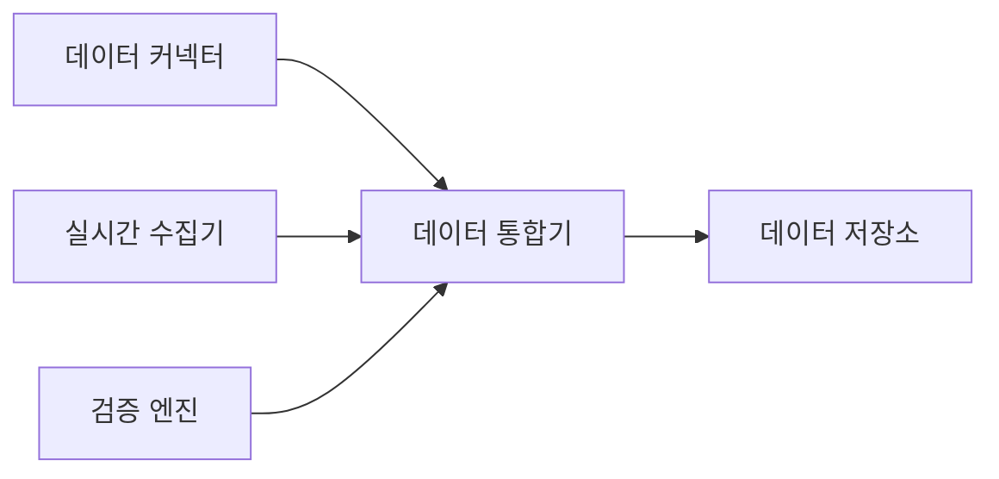
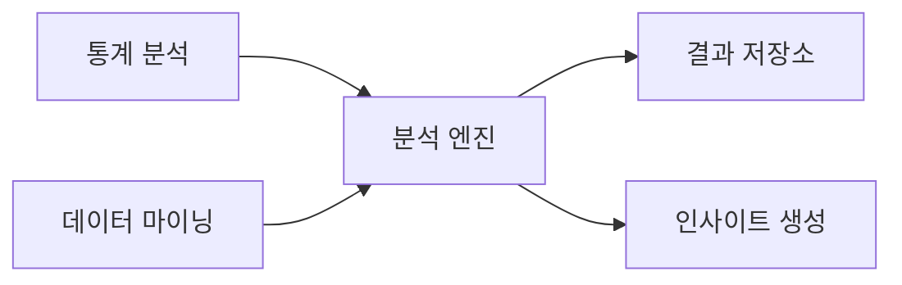
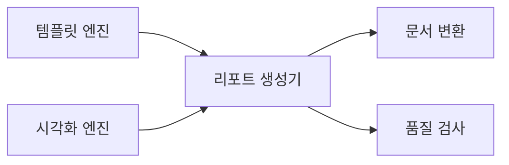

# 리포트 자동화 시스템 설계

## 1. 시스템 아키텍처

### 1.1 전체 구조

### 1.2 레이어별 주요 기능

#### 데이터 수집 레이어
- 다중 소스 데이터 통합
- 실시간 데이터 동기화
- 데이터 검증 및 정제

#### 분석 레이어
- 데이터 분석 및 가공
- 통계 처리
- 인사이트 도출

#### 리포트 생성 레이어
- 템플릿 기반 리포트 생성
- 시각화 자동화
- 문서 포맷팅

#### 서비스 레이어
- API 서비스
- 배포 관리
- 알림 서비스

## 2. 상세 컴포넌트 설계

### 2.1 데이터 수집 레이어

#### 핵심 컴포넌트
1. **데이터 통합 모듈**
   - 다중 소스 연결
   - 데이터 매핑
   - 정합성 검증
   - 메타데이터 관리

### 2.2 분석 레이어

#### 주요 프로세스
1. **분석 파이프라인**
   - 데이터 전처리
   - 통계 분석
   - 패턴 발견
   - 예측 분석

### 2.3 리포트 생성 레이어

#### 리포트 컴포넌트
1. **리포트 엔진**
   - 템플릿 관리
   - 콘텐츠 생성
   - 자동 포맷팅
   - 품질 검증

## 3. 기술 스택

### 3.1 백엔드
- **언어**: Python 3.11+
- **프레임워크**: 
  - FastAPI 0.100+
  - LangChain 0.1.0+
- **데이터베이스**: 
  - 관계형: MariaDB 10.11+, Oracle 21c+, MSSQL 2022+
  - 벡터 DB: Weaviate
- **캐시**: Redis 7.2+
- **메시징**: Apache Kafka 3.6+

### 3.2 AI/ML
- **LLM 통합**:
  - LangChain
  - OpenAI GPT-4
  - Claude 3
- **문서 생성**:
  - LangChain Agents
  - Custom Templates
- **RAG 구현**:
  - LangChain RAG
  - Vector Store: Weaviate
  - Cross-Encoder Reranking
- **데이터 시각화**: 
  - Plotly 5.x
  - Altair 5.x
  - Seaborn 0.13+

### 3.3 프론트엔드
- **프레임워크**: Next.js 14+
- **상태관리**: TanStack Query
- **차트**: TanStack Chart
- **UI**: Shadcn/ui
- **스타일링**: Tailwind CSS
- **문서 뷰어**: PDF.js

## 4. 보안 설계

### 4.1 데이터 보안
- 데이터 암호화
- 접근 제어
- 감사 추적

### 4.2 시스템 보안
- 인증/인가
- API 보안
- 문서 보안

## 5. 확장성 설계

### 5.1 시스템 확장성
- 마이크로서비스 구조
- 컨테이너화
- 자동 스케일링

### 5.2 기능 확장성
- 템플릿 확장성
- 포맷 지원 확장
- 분석 모듈 확장 