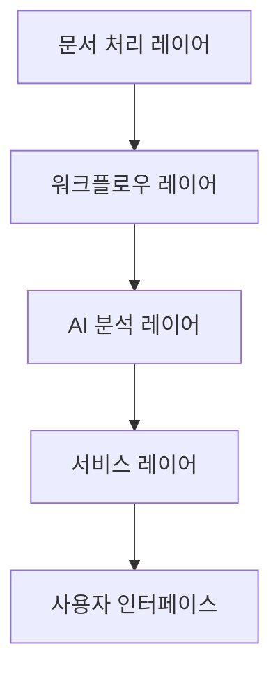
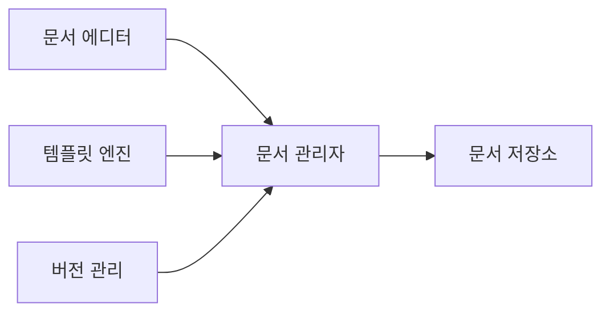
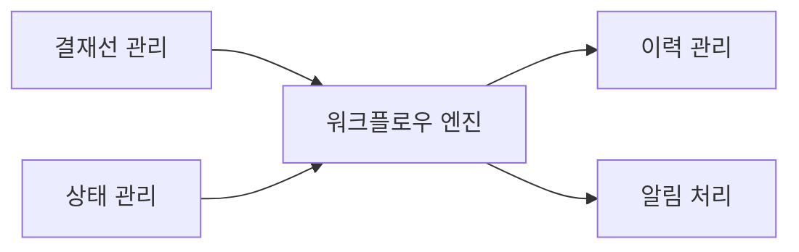
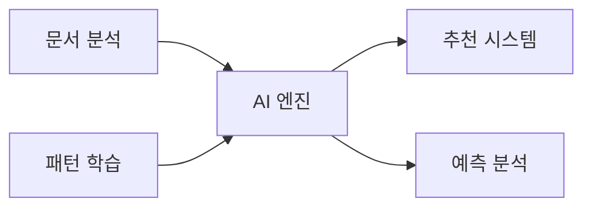

# 전자결재 AI 시스템 설계

## 1. 시스템 아키텍처

### 1.1 전체 구조

### 1.2 레이어별 주요 기능

#### 문서 처리 레이어
- 전자문서 생성/관리
- 템플릿 관리
- 문서 이력 관리

#### 워크플로우 레이어
- 결재선 관리
- 프로세스 실행 엔진
- 상태 관리

#### AI 분석 레이어
- 문서 자동 분류
- 결재 우선순위 예측
- 지능형 결재선 추천

#### 서비스 레이어
- API 서비스
- 알림 서비스
- 통계/리포트

## 2. 상세 컴포넌트 설계

### 2.1 문서 처리 레이어

#### 핵심 컴포넌트
1. **문서 관리 모듈**
   - 문서 생성/편집
   - 템플릿 관리
   - 이력 추적
   - 첨부파일 처리

### 2.2 워크플로우 레이어

#### 주요 프로세스
1. **워크플로우 엔진**
   - 결재 프로세스 실행
   - 상태 전이 관리
   - 권한 검증
   - 알림 발송

### 2.3 AI 분석 레이어

#### 분석 컴포넌트
1. **AI 엔진**
   - 문서 분류
   - 우선순위 산정
   - 결재선 추천
   - 처리시간 예측

## 3. 기술 스택

### 3.1 백엔드
- **언어**: Python 3.11+
- **프레임워크**: 
  - FastAPI 0.100+
  - LangChain 0.1.0+
- **데이터베이스**: 
  - 관계형: MariaDB 10.11+, Oracle 21c+, MSSQL 2022+
  - 벡터 DB: Milvus
- **캐시**: Redis 7.2+
- **메시징**: Apache Kafka 3.6+

### 3.2 AI/ML
- **LLM 통합**:
  - LangChain
  - OpenAI GPT-4
  - Claude 3
- **문서 처리**:
  - LangChain Document Loaders
  - Unstructured
  - OCR: Tesseract 5.3+
- **RAG 구현**:
  - LangChain RAG
  - Vector Store: Milvus
  - Hybrid Search
- **워크플로우 엔진**: 
  - Airflow 2.7+
  - Prefect 2.x

### 3.3 프론트엔드
- **프레임워크**: Next.js 14+
- **상태관리**: Zustand
- **UI**: Shadcn/ui
- **스타일링**: Tailwind CSS
- **문서 편집**: TipTap

## 4. 보안 설계

### 4.1 문서 보안
- 문서 암호화
- 전자서명
- 위변조 방지

### 4.2 시스템 보안
- SSO 통합인증
- 이중 인증(2FA)
- 감사 로그

## 5. 확장성 설계

### 5.1 시스템 확장성
- MSA 구조
- 컨테이너 기반 배포
- 로드밸런싱

### 5.2 스토리지 확장성
- 문서 분산 저장
- 캐시 계층화
- CDN 활용 