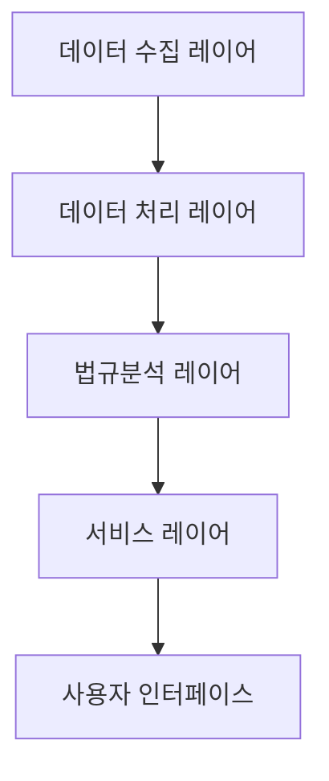
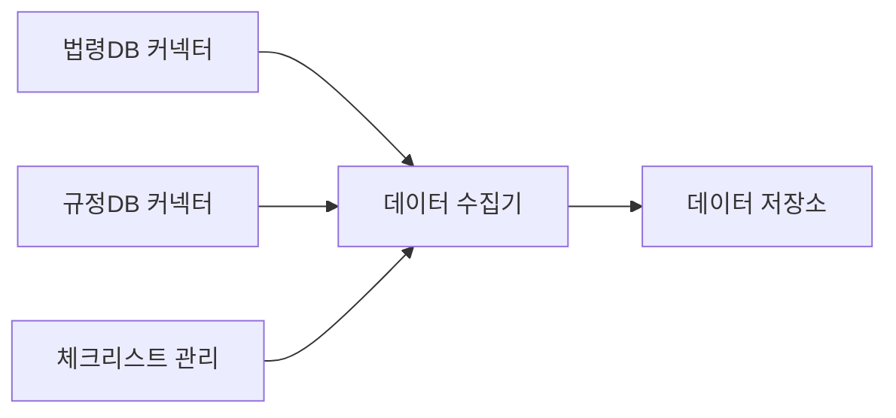
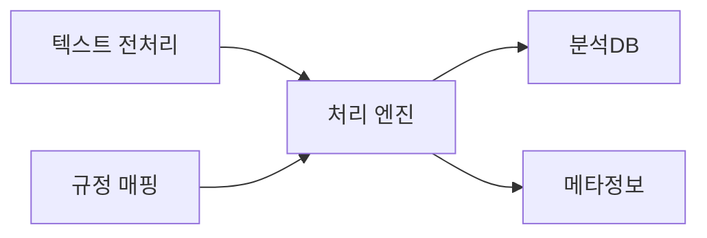
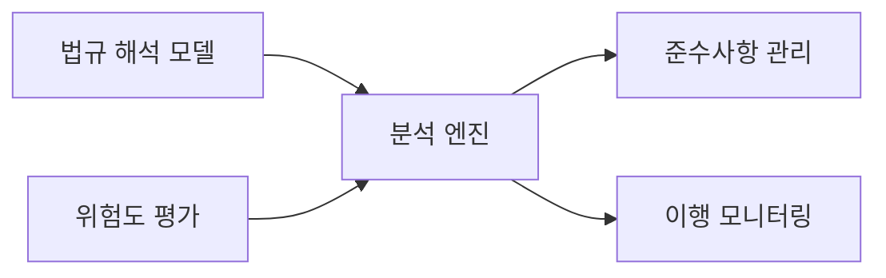

# 법규준수 AI 시스템 설계

## 1. 시스템 아키텍처

### 1.1 전체 구조

### 1.2 레이어별 주요 기능

#### 데이터 수집 레이어
- 법령 데이터 자동 수집
- 내부 규정 데이터 수집
- 컴플라이언스 체크리스트 관리

#### 데이터 처리 레이어
- 법령 데이터 정제
- 텍스트 마이닝
- 규정 매핑 처리

#### 법규분석 레이어
- AI 기반 법규 해석
- 컴플라이언스 위험 분석
- 준수사항 자동 추출

#### 서비스 레이어
- 법규준수 API 제공
- 알림 서비스
- 리포트 생성

## 2. 상세 컴포넌트 설계

### 2.1 데이터 수집 레이어

#### 핵심 컴포넌트
1. **데이터 수집 모듈**
   - 법령정보 크롤링
   - 내부규정 동기화
   - 체크리스트 관리
   - 변경사항 추적

### 2.2 데이터 처리 레이어

#### 주요 프로세스
1. **텍스트 분석 파이프라인**
   - 자연어 처리
   - 키워드 추출
   - 문서 분류
   - 의미 분석

### 2.3 법규분석 레이어

#### 분석 컴포넌트
1. **AI 분석 모델**
   - 법규 해석
   - 위험도 평가
   - 영향도 분석
   - 준수여부 판단

## 3. 기술 스택

### 3.1 백엔드
- **언어**: Python 3.11+
- **프레임워크**: 
  - FastAPI 0.100+
  - LangChain 0.1.0+
- **데이터베이스**: 
  - 관계형: MariaDB 10.11+ (기본)
    - Oracle 21c+ (선택)
    - MSSQL 2022+ (선택)
  - 벡터 DB: Qdrant
- **캐시**: Redis 7.2+

### 3.2 AI/ML
- **LLM 통합**:
  - LangChain
  - Claude 3
  - Anthropic Claude Pro
- **문서 이해**:
  - LangChain Document Loaders
  - Unstructured
- **RAG 구현**:
  - LangChain RAG
  - Vector Store: Qdrant
  - Cross-Encoder Reranking
- **NLP**: 
  - Transformers 4.36+
  - SpaCy 3.7+

### 3.3 프론트엔드
- **프레임워크**: Next.js 14+
- **상태관리**: TanStack Query
- **UI**: Shadcn/ui
- **스타일링**: Tailwind CSS

## 4. 보안 설계

### 4.1 데이터 보안
- 문서 암호화
- 접근 권한 관리
- 감사 로그 관리

### 4.2 시스템 보안
- SSO 인증
- IP 기반 접근 제어
- API 보안

## 5. 확장성 설계

### 5.1 시스템 확장성
- 마이크로서비스 구조
- 컨테이너화
- 자동 스케일링

### 5.2 데이터 확장성
- 분산 검색 엔진
- 문서 버전 관리
- 실시간 동기화 