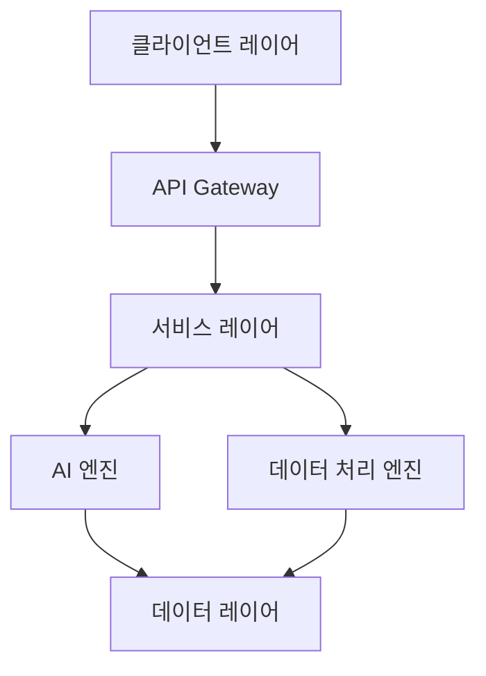
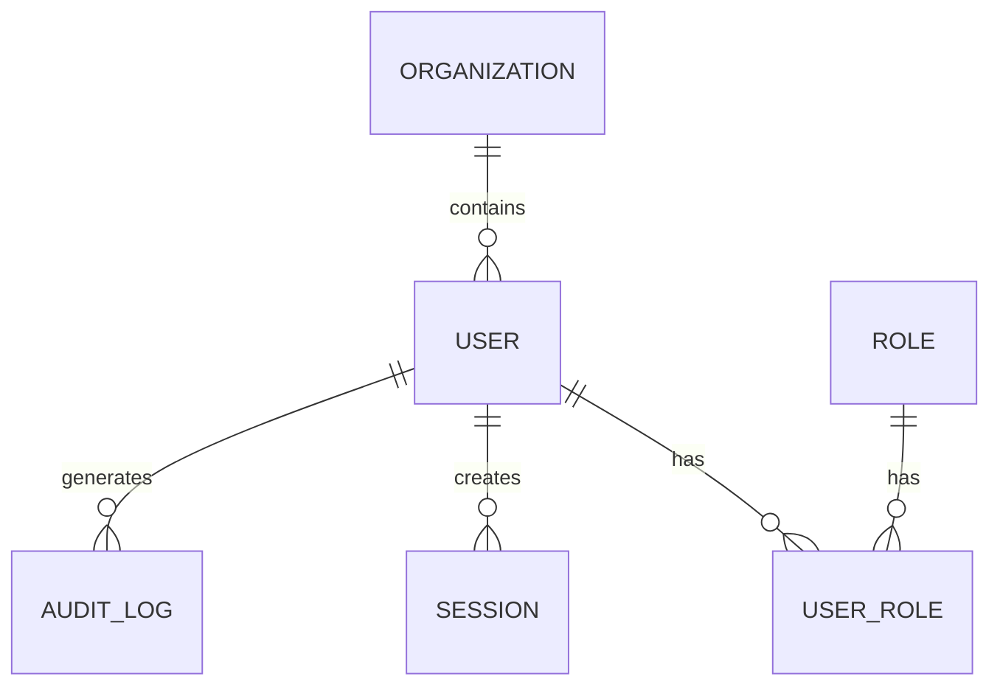
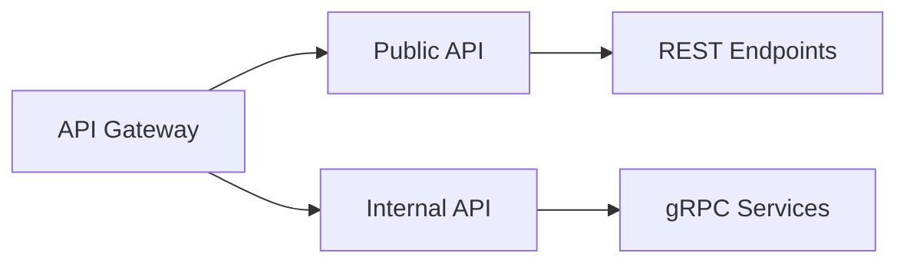
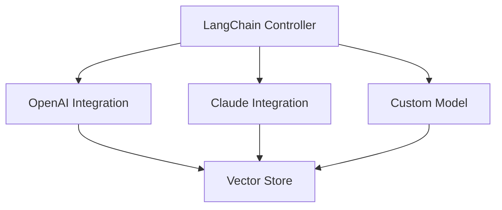
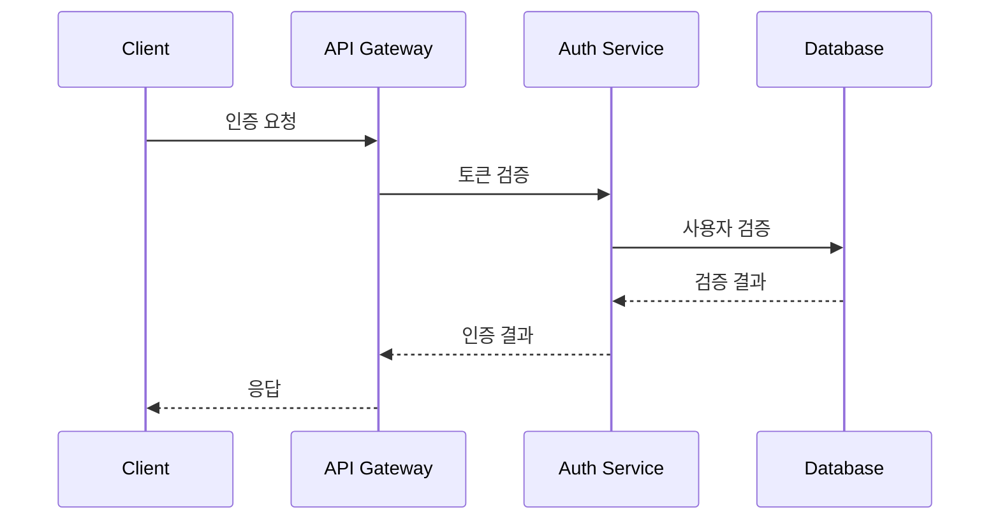
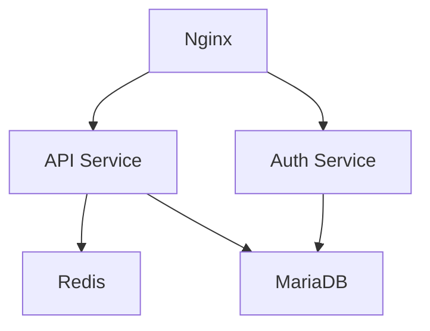
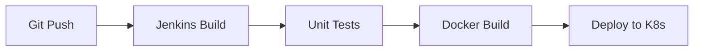

# 프로그램 설계 상세 문서

## 1. 시스템 아키텍처 개요

### 1.1 전체 시스템 구조


### 1.2 마이크로서비스 구성
- **코어 서비스**
  - 사용자 관리 서비스
  - 인증/인가 서비스
  - 데이터 관리 서비스
  - AI 분석 서비스

- **비즈니스 서비스**
  - 예산 분석 서비스
  - 회계 처리 서비스
  - 자산 관리 서비스
  - 법규 준수 서비스
  - 리포트 생성 서비스
  - 챗봇 서비스

## 2. 상세 설계

### 2.1 데이터 레이어 설계

#### 2.1.1 데이터베이스 구조


#### 2.1.2 데이터베이스 분리 전략
- **관계형 데이터베이스**
  - 기본 RDBMS: MariaDB 10.11+
    - 트랜잭션 데이터
    - 운영 데이터
    - 기본 데이터 저장소
  - 호환 RDBMS (선택사항)
    - Oracle 21c+: 레거시 시스템 연동
    - MSSQL 2022+: 특수 기능 필요시

- **비관계형 데이터베이스**
  - 문서 저장소: MongoDB
  - 벡터 데이터: Weaviate/Chroma
  - 캐시: Redis

#### 2.1.3 데이터베이스 호환성 설계
- **SQL 표준 준수**
  - ANSI SQL 표준 문법 사용
  - 벤더 종속적 기능 최소화
  - 공통 데이터 타입 사용

- **데이터베이스 추상화**
  - SQLAlchemy ORM 활용
  - 데이터베이스 중립적 모델 설계
  - 마이그레이션 스크립트 관리

- **호환성 테스트**
  - 각 DBMS별 단위 테스트
  - 마이그레이션 테스트
  - 성능 비교 테스트

### 2.2 서비스 레이어 설계

#### 2.2.1 API 구조


#### 2.2.2 서비스 인터페이스
```python
# 예시 인터페이스 구조
class BaseService(ABC):
    @abstractmethod
    async def process(self, request: Request) -> Response:
        pass

    @abstractmethod
    async def validate(self, data: Dict) -> bool:
        pass
```

### 2.3 AI 엔진 설계

#### 2.3.1 LLM 통합 구조


#### 2.3.2 RAG 파이프라인
```python
# RAG 구현 예시
class RAGPipeline:
    def __init__(self):
        self.retriever = Retriever()
        self.generator = Generator()
        self.reranker = Reranker()

    async def process(self, query: str) -> str:
        docs = await self.retriever.get_relevant_docs(query)
        reranked_docs = await self.reranker.rerank(docs)
        response = await self.generator.generate(query, reranked_docs)
        return response
```

### 2.4 보안 설계

#### 2.4.1 인증/인가 흐름


#### 2.4.2 데이터 보안
```python
# 데이터 암호화 예시
class DataEncryption:
    def __init__(self):
        self.cipher_suite = Fernet(key)

    def encrypt(self, data: str) -> str:
        return self.cipher_suite.encrypt(data.encode())

    def decrypt(self, encrypted_data: bytes) -> str:
        return self.cipher_suite.decrypt(encrypted_data).decode()
```

## 3. 구현 가이드라인

### 3.1 코드 구조
```
src/
├── core/
│   ├── config/
│   ├── security/
│   └── utils/
├── services/
│   ├── auth/
│   ├── user/
│   └── ai/
├── models/
│   ├── domain/
│   └── dto/
└── api/
    ├── v1/
    └── internal/
```

### 3.2 개발 표준

#### 3.2.1 코드 스타일
- Black 코드 포맷터 사용
- Pylint 정적 분석
- Type Hints 필수 사용

#### 3.2.2 문서화 표준
```python
def process_data(data: Dict[str, Any]) -> Result:
    """데이터 처리 함수

    Args:
        data: 처리할 데이터 딕셔너리

    Returns:
        처리 결과 객체

    Raises:
        ValidationError: 데이터 검증 실패 시
    """
    pass
```

### 3.3 테스트 전략

#### 3.3.1 테스트 레벨
- 단위 테스트: pytest
- 통합 테스트: pytest-asyncio
- E2E 테스트: Robot Framework

#### 3.3.2 테스트 커버리지
```python
# 테스트 예시
@pytest.mark.asyncio
async def test_rag_pipeline():
    pipeline = RAGPipeline()
    result = await pipeline.process("test query")
    assert result is not None
    assert len(result) > 0
```

## 4. 배포 아키텍처

### 4.1 컨테이너 구성


### 4.2 CI/CD 파이프라인


## 5. 모니터링 및 로깅

### 5.1 모니터링 구조
- Prometheus 메트릭 수집
- Grafana 대시보드
- ELK 스택 로그 분석

### 5.2 알림 설정
```yaml
alerts:
  - name: high_error_rate
    condition: error_rate > 1%
    duration: 5m
    channels:
      - slack
      - email
``` 