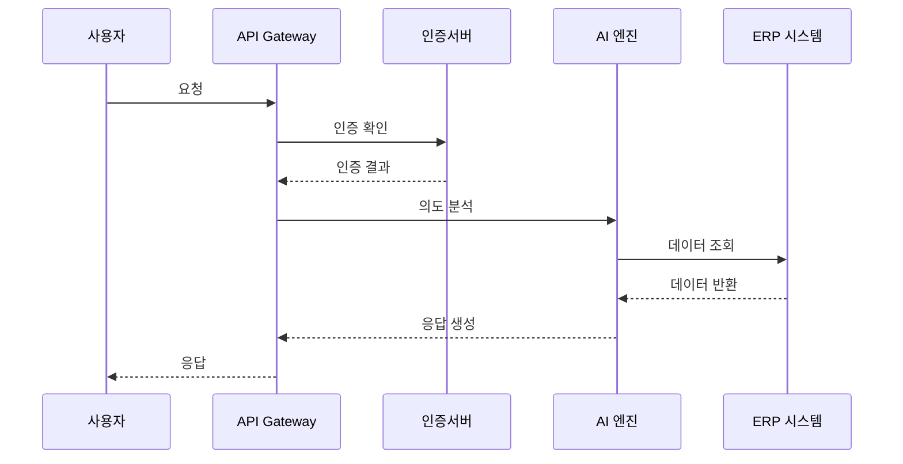
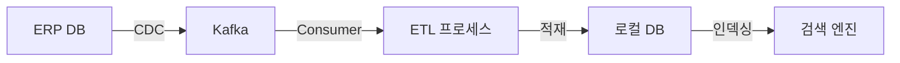

# ERP 챗봇 시스템 개요

## 1. 시스템 아키텍처 개요

### 1.1 하드웨어 구성
```yaml
베어본 서버 사양:
  CPU: Intel Xeon Scalable
  GPU: NVIDIA RTX 4000 Ada × 4
  Memory: 256GB
  Storage: 4TB NVMe SSD
  네트워크: 10Gbps
```

### 1.2 시스템 구성 요소
1. **프론트엔드 시스템**
   - 웹 클라이언트 (React.js)
   - 모바일 클라이언트 (React Native)
   - 관리자 도구 (Admin Dashboard)

2. **백엔드 시스템**
   - API 서버 (Spring Boot)
   - 인증 서버 (Keycloak)
   - 채팅 서버 (WebSocket)

3. **AI 시스템**
   - LLM 서버 (Custom LLM)
   - RAG 시스템 (Vector Database)
   - 학습 파이프라인 (MLflow)

4. **데이터 시스템**
   - 관계형 DB (MariaDB)
   - 검색 엔진 (Elasticsearch)
   - 캐시 서버 (Redis)

### 1.3 리소스 할당
```yaml
리소스 할당:
  AI 시스템:
    GPU: NVIDIA RTX 4000 Ada × 3
    Memory: 128GB
    Storage: 2TB
    
  애플리케이션/DB:
    GPU: NVIDIA RTX 4000 Ada × 1
    Memory: 128GB
    Storage: 2TB
    
  컨테이너 구성:
    - API/채팅 서버: 32GB
    - MariaDB: 64GB
    - Elasticsearch: 32GB
    - Redis: 16GB
    - 모니터링: 16GB
```

## 2. 가상화 및 컨테이너 구성

### 2.1 Docker 컨테이너 구성
```yaml
컨테이너 구성:
  애플리케이션:
    - api-server
    - chat-server
    - auth-server
    
  AI:
    - llm-server
    - vector-db
    - training-server
    
  데이터베이스:
    - mariadb
    - elasticsearch
    - redis
    
  모니터링:
    - prometheus
    - grafana
    - alertmanager
```

## 3. 핵심 컴포넌트

### 3.1 AI 엔진
- **Custom LLM**
  - 기업 특화 파인튜닝
  - 한국어 최적화
  - ERP 도메인 학습

- **RAG 시스템**
  ```mermaid
  graph LR
    A[사용자 질의] --> B[임베딩 생성]
    B --> C[Vector DB 검색]
    C --> D[컨텍스트 생성]
    D --> E[LLM 추론]
    E --> F[응답 생성]
  ```

### 3.2 ERP 연동 시스템
- **데이터 동기화**
  ```mermaid
  graph TD
    A[ERP 시스템] --> B[CDC Connector]
    B --> C[메시지 큐]
    C --> D[데이터 프로세서]
    D --> E[로컬 DB]
  ```

- **API 게이트웨이**
  - 요청 라우팅
  - 인증/인가 처리
  - 속도 제한
  - 캐시 관리

### 3.3 모니터링 시스템
- **성능 모니터링**
  - API 응답 시간
  - AI 추론 시간
  - 리소스 사용량

- **로그 관리**
  - 애플리케이션 로그
  - 시스템 로그
  - 보안 감사 로그

## 4. 데이터 흐름

### 4.1 사용자 요청 처리


### 4.2 데이터 동기화 흐름


## 5. 용어 설명

### 5.1 아키텍처 용어
- **마이크로서비스**: 애플리케이션을 작은 독립적인 서비스로 분리하여 개발하는 아키텍처 스타일
- **CDC(Change Data Capture)**: 데이터베이스의 변경사항을 실시간으로 감지하고 전파하는 기술
- **ETL(Extract, Transform, Load)**: 데이터를 추출, 변환, 적재하는 프로세스

### 5.2 기술 용어
- **WebSocket**: 실시간 양방향 통신을 지원하는 프로토콜
- **Vector Database**: 벡터 형태의 데이터를 저장하고 검색하는 데이터베이스
- **MLflow**: 머신러닝 라이프사이클 관리 플랫폼 