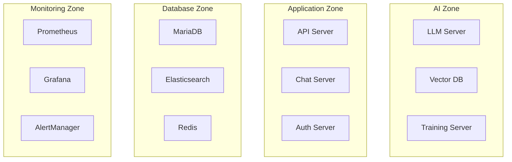

# 물리 인프라 구성

## 1. 서버 구성

### 1.1 하드웨어 사양
```yaml
베어본 서버:
  CPU: Intel Xeon Scalable
  GPU: NVIDIA RTX 4000 Ada × 4
  Memory: 256GB
  Storage: 4TB NVMe SSD
  네트워크: 10Gbps
```

### 1.2 리소스 할당
```yaml
리소스 할당:
  AI 시스템:
    GPU: NVIDIA RTX 4000 Ada × 3
    Memory: 128GB
    Storage: 2TB
    용도:
      - LLM 추론
      - 벡터 검색
      - 모델 학습
    
  애플리케이션/DB:
    GPU: NVIDIA RTX 4000 Ada × 1
    Memory: 128GB
    Storage: 2TB
    용도:
      - API 서버
      - 데이터베이스
      - 캐시/검색엔진
```

## 2. 컨테이너 구성

### 2.1 Docker 컨테이너 구조


### 2.2 컨테이너 리소스 할당
```yaml
컨테이너 할당:
  AI 서비스:
    llm-server:
      memory: 64GB
      gpu: "device=0,1"
    vector-db:
      memory: 32GB
      gpu: "device=2"
    training-server:
      memory: 32GB
      gpu: "device=2"
      
  애플리케이션:
    api-server:
      memory: 16GB
      gpu: "device=3"
    chat-server:
      memory: 8GB
    auth-server:
      memory: 4GB
      
  데이터베이스:
    mariadb:
      memory: 64GB
    elasticsearch:
      memory: 32GB
    redis:
      memory: 16GB
      
  모니터링:
    prometheus:
      memory: 8GB
    grafana:
      memory: 4GB
    alertmanager:
      memory: 2GB
```

## 3. 네트워크 구성

### 3.1 네트워크 분리
```yaml
네트워크 세그먼트:
  frontend_net:
    subnet: 172.20.0.0/24
    용도: 외부 접근 처리
    
  backend_net:
    subnet: 172.20.1.0/24
    용도: 내부 서비스 통신
    
  db_net:
    subnet: 172.20.2.0/24
    용도: 데이터베이스 통신
    
  monitoring_net:
    subnet: 172.20.3.0/24
    용도: 모니터링 시스템
```

### 3.2 보안 구성
```yaml
보안 정책:
  외부 접근:
    - HTTPS(443): 웹 서비스
    - WSS(443): 웹소켓
    
  내부 통신:
    - 컨테이너 간: TLS 1.3
    - 서비스 메시: mTLS
    
  관리자 접근:
    - SSH(22): VPN 필수
    - 관리 포털(8443): VPN 필수
```

## 4. 스토리지 구성

### 4.1 볼륨 할당
```yaml
볼륨 구성:
  데이터베이스:
    mariadb:
      크기: 1TB
      타입: local-ssd
      백업: 자동
      
    elasticsearch:
      크기: 500GB
      타입: local-ssd
      백업: 스냅샷
      
  AI 모델:
    model_storage:
      크기: 1TB
      타입: local-ssd
      백업: 버전 관리
      
  로그/모니터링:
    log_storage:
      크기: 500GB
      타입: local-ssd
      보관: 30일
```

### 4.2 백업 정책
```yaml
백업 구성:
  데이터베이스:
    전체 백업:
      주기: 매일 02:00
      보관: 30일
      방식: mariabackup
      
    증분 백업:
      주기: 1시간
      보관: 7일
      방식: 바이너리 로그
      
  AI 모델:
    모델 백업:
      주기: 버전 변경 시
      보관: 최근 5개 버전
      방식: 전체 복사
```

## 5. 용어 설명

### 5.1 하드웨어 용어
- **베어본 서버**: 기본적인 하드웨어만 포함된 서버
- **NVMe**: 고성능 SSD를 위한 인터페이스 규격
- **RTX 4000 Ada**: NVIDIA의 고성능 GPU

### 5.2 네트워크 용어
- **mTLS**: 상호 TLS 인증, 양방향 인증 프로토콜
- **서비스 메시**: 마이크로서비스 간의 통신을 관리하는 인프라 계층
- **WSS**: 보안이 적용된 웹소켓 프로토콜