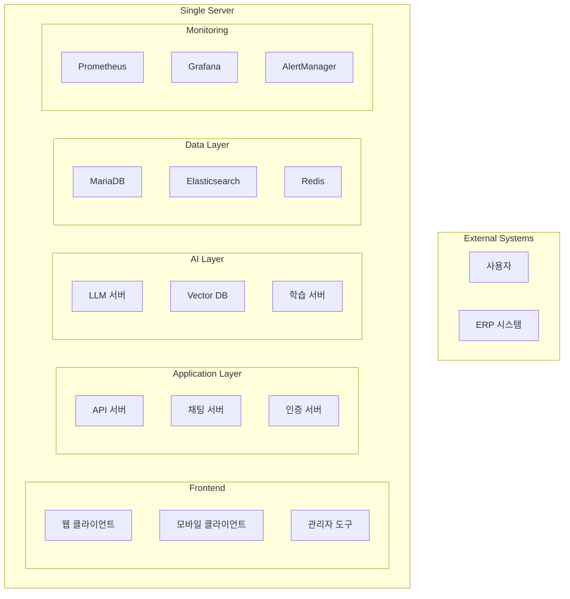
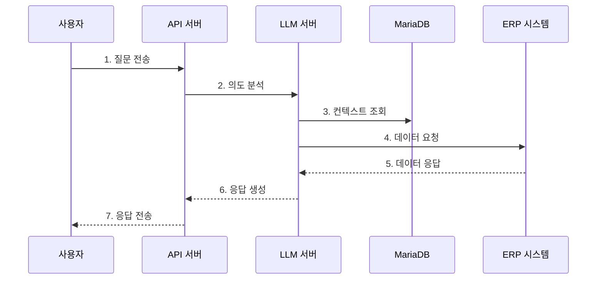
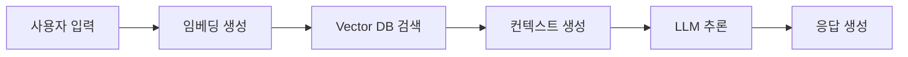

# 시스템 구성도

## 1. 전체 시스템 구성

### 1.1 시스템 아키텍처


### 1.2 리소스 할당
```yaml
리소스 할당:
  AI 시스템:
    GPU: NVIDIA RTX 4000 Ada × 3
    Memory: 128GB
    Storage: 2TB
    용도:
      - LLM 추론
      - 벡터 검색
      - 모델 학습
    
  애플리케이션/DB:
    GPU: NVIDIA RTX 4000 Ada × 1
    Memory: 128GB
    Storage: 2TB
    용도:
      - API 서버
      - 데이터베이스
      - 캐시/검색엔진
```

### 1.1 하드웨어 구성
```yaml
베어본 서버:
  CPU: Intel Xeon Scalable
  GPU: NVIDIA RTX 4000 Ada × 4
  Memory: 256GB
  Storage: 4TB NVMe SSD
  네트워크: 10Gbps  # 내부 네트워크 구성은 보안상 비공개
```

## 2. 컨테이너 구성

### 2.1 Docker 컨테이너 구조
```yaml
컨테이너 구성:
  AI 서비스:
    llm-server:
      memory: 64GB
      gpu: "device=0,1"
    vector-db:
      memory: 32GB
      gpu: "device=2"
    training-server:
      memory: 32GB
      gpu: "device=2"
      
  애플리케이션:
    api-server:
      memory: 16GB
      gpu: "device=3"
    chat-server:
      memory: 8GB
    auth-server:
      memory: 4GB
      
  데이터베이스:
    mariadb:
      memory: 64GB
    elasticsearch:
      memory: 32GB
    redis:
      memory: 16GB
      
  모니터링:
    prometheus:
      memory: 8GB
    grafana:
      memory: 4GB
    alertmanager:
      memory: 2GB
```

## 3. 데이터 흐름

### 3.1 사용자 요청 처리


### 3.2 AI 추론 프로세스


## 4. 보안 구성

### 4.1 네트워크 보안
```yaml
보안 정책:
  외부 접근:
    - HTTPS(443): 웹 서비스
    - WSS(443): 웹소켓
    # 실제 포트 정보는 보안상 비공개
    
  내부 통신:
    - 컨테이너 간: TLS 1.3
    - 서비스 메시: mTLS
    # 상세 네트워크 구성은 보안상 비공개
```

## 5. 용어 설명

### 5.1 시스템 용어
- **컨테이너**: Docker를 사용한 가상화 단위
- **서비스 메시**: 마이크로서비스 간의 통신을 관리하는 인프라 계층
- **로드 밸런서**: 서비스 부하를 분산하는 시스템

### 5.2 보안 용어
- **mTLS**: 상호 TLS 인증, 양방향 인증 프로토콜
- **VPN**: 가상 사설망, 보안 통신을 위한 네트워크
- **WSS**: 보안이 적용된 웹소켓 프로토콜