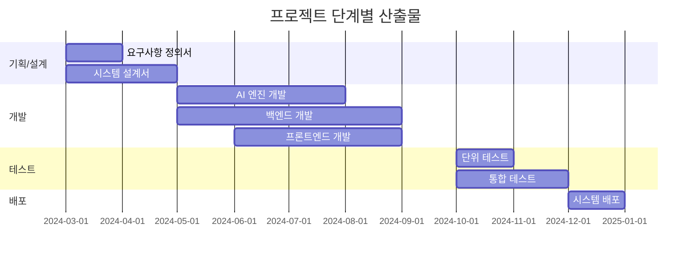

# 프로젝트 일정 계획

## 1. 프로젝트 개요

### 1.1 프로젝트 기간
- **전체 기간**: 2024.03 ~ 2024.12 (10개월)
- **주요 마일스톤**:
  - 기획/설계: 2024.03 ~ 2024.04 (2개월)
  - 개발: 2024.05 ~ 2024.09 (5개월)
  - 테스트/안정화: 2024.10 ~ 2024.11 (2개월)
  - 배포/운영: 2024.12 (1개월)

### 1.2 단계별 산출물


## 2. 단계별 세부 일정

### 2.1 기획/설계 단계 (2024.03 ~ 2024.04)
1. **요구사항 분석 (3주)**
   - 사용자 인터뷰
   - 현행 시스템 분석
   - 요구사항 정의
   - 범위 확정

2. **시스템 설계 (5주)**
   - 아키텍처 설계
   - DB 설계
   - API 설계
   - UI/UX 설계

### 2.2 개발 단계 (2024.05 ~ 2024.09)
1. **AI 엔진 개발 (12주)**
   ```yaml
   일정:
     - Custom LLM 개발: 6주
     - RAG 시스템 구현: 4주
     - 성능 최적화: 2주
   
   마일스톤:
     - LLM 기본 모델 완성: 2024-06
     - RAG 시스템 통합: 2024-07
     - 성능 최적화 완료: 2024-07
   ```

2. **백엔드 개발 (16주)**
   ```yaml
   일정:
     - 기본 인프라 구축: 4주
     - API 서버 개발: 8주
     - ERP 연동 개발: 4주
   
   마일스톤:
     - 인프라 구축 완료: 2024-06
     - API 개발 완료: 2024-08
     - ERP 연동 완료: 2024-09
   ```

3. **프론트엔드 개발 (12주)**
   ```yaml
   일정:
     - 웹 클라이언트: 8주
     - 모바일 클라이언트: 8주
     - 관리자 도구: 4주
   
   마일스톤:
     - 웹 버전 완료: 2024-08
     - 모바일 버전 완료: 2024-09
     - 관리자 도구 완료: 2024-09
   ```

### 2.3 테스트 단계 (2024.10 ~ 2024.11)
1. **테스트 계획 (2주)**
   - 테스트 시나리오 작성
   - 테스트 데이터 준비
   - 테스트 환경 구축

2. **테스트 실행 (6주)**
   ```yaml
   일정:
     - 단위 테스트: 3주
     - 통합 테스트: 3주
     - 성능 테스트: 2주
     - 보안 테스트: 2주
   
   기준:
     - 코드 커버리지: 80% 이상
     - 성능 목표: 응답시간 1초 이내
     - 보안 취약점: Zero Critical
   ```

### 2.4 배포/운영 단계 (2024.12)
1. **배포 준비 (2주)**
   - 운영 환경 구축
   - 모니터링 시스템 구축
   - 운영 매뉴얼 작성

2. **시스템 배포 (2주)**
   - 단계적 배포
   - 사용자 교육
   - 안정화 지원

## 3. 리스크 관리

### 3.1 주요 리스크
```yaml
기술적 리스크:
  - AI 모델 성능 미달
  - ERP 연동 지연
  - 성능 이슈

일정 리스크:
  - 요구사항 변경
  - 인력 부족
  - 외부 의존성

대응 방안:
  - 버퍼 일정 확보 (20%)
  - 주간 리스크 리뷰
  - 대체 방안 준비
```

### 3.2 이슈 관리 프로세스


## 4. 용어 설명

### 4.1 프로젝트 용어
- **마일스톤**: 프로젝트의 주요 진행 단계를 표시하는 지점
- **버퍼**: 예상치 못한 상황에 대비한 여유 시간
- **크리티컬 패스**: 프로젝트 완료에 영향을 미치는 핵심 경로

### 4.2 개발 방법론 용어
- **애자일**: 반복적인 개발과 협력을 강조하는 개발 방법론
- **스프린트**: 2-4주 단위의 개발 주기
- **스크럼**: 애자일 방법론의 하나로, 팀 단위의 개발 프레임워크 