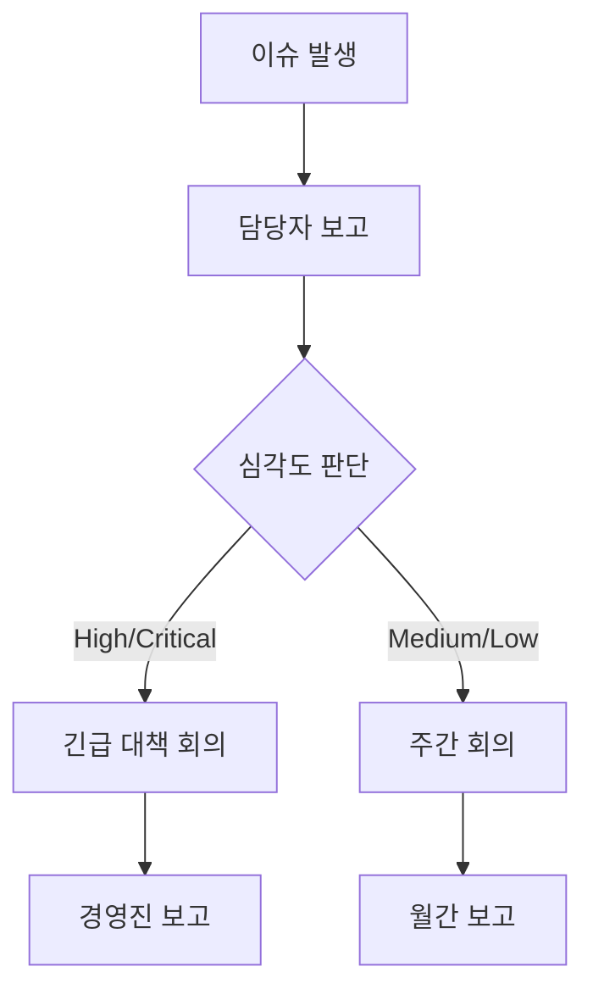

# 위험 관리 계획

## 1. 위험 관리 체계

### 1.1 위험 관리 프로세스


### 1.2 위험 평가 매트릭스
```yaml
영향도 수준:
  Critical: 프로젝트 실패 위험
  High: 주요 기능/일정 차질
  Medium: 일부 기능/일정 차질
  Low: 경미한 영향

발생 가능성:
  Very High: 90% 이상
  High: 60-90%
  Medium: 30-60%
  Low: 30% 미만

위험도 = 영향도 × 발생가능성
```

## 2. 주요 위험 요소

### 2.1 기술적 위험
1. **AI 모델 성능**
   ```yaml
   위험 내용:
     - 정확도 목표 미달
     - 응답 시간 초과
     - 한국어 처리 부정확
   
   영향도: Critical
   발생가능성: High
   
   대응 방안:
     - 단계적 모델 개선
     - 백업 모델 준비
     - 지속적 성능 모니터링
     - 전문가 자문 확보
   ```

2. **ERP 연동**
   ```yaml
   위험 내용:
     - API 호환성 문제
     - 데이터 동기화 지연
     - 성능 저하
   
   영향도: High
   발생가능성: Medium
   
   대응 방안:
     - 사전 POC 진행
     - 단계적 연동 구현
     - 캐시 전략 수립
     - 페일오버 시스템 구축
   ```

### 2.2 프로젝트 위험
1. **일정 관리**
   ```yaml
   위험 내용:
     - 요구사항 변경 증가
     - 개발 지연
     - 테스트 일정 부족
   
   영향도: High
   발생가능성: High
   
   대응 방안:
     - 20% 버퍼 추가
     - 주간 진척 관리
     - 우선순위 조정
     - 인력 보강 계획
   ```

2. **리소스 관리**
   ```yaml
   위험 내용:
     - 전문 인력 부족
     - GPU 자원 부족
     - 예산 초과
   
   영향도: Medium
   발생가능성: Medium
   
   대응 방안:
     - 사전 인력 확보
     - 클라우드 자원 활용
     - 예산 모니터링
   ```

### 2.3 보안 위험
1. **데이터 보안**
   ```yaml
   위험 내용:
     - 개인정보 유출
     - 무단 접근
     - 데이터 유실
   
   영향도: Critical
   발생가능성: Low
   
   대응 방안:
     - 암호화 적용
     - 접근 통제 강화
     - 감사 로그 관리
     - 백업 정책 수립
   ```

2. **시스템 보안**
   ```yaml
   위험 내용:
     - 해킹 위험
     - 서비스 장애
     - 악성코드 감염
   
   영향도: High
   발생가능성: Medium
   
   대응 방안:
     - 보안 감사 실시
     - IPS/WAF 구축
     - 모니터링 강화
     - 패치 관리
   ```

## 3. 위험 모니터링

### 3.1 모니터링 지표
```yaml
기술 지표:
  - AI 모델 정확도
  - 응답 시간
  - 오류율
  - 시스템 가용성

프로젝트 지표:
  - 일정 준수율
  - 이슈 해결률
  - 리소스 사용률
  - 예산 소진율

보안 지표:
  - 보안 사고 건수
  - 취약점 발견 수
  - 패치 적용률
  - 감사 로그 이상 건수
```

### 3.2 보고 체계


## 4. 비상 대응 계획

### 4.1 에스컬레이션 매트릭스
```yaml
Level 1 (담당자 대응):
  - 일반적인 오류
  - 경미한 성능 저하
  - 단순 문의

Level 2 (팀장 대응):
  - 반복적 오류
  - 성능 저하 지속
  - 데이터 동기화 실패

Level 3 (PM 대응):
  - 주요 기능 장애
  - 심각한 성능 저하
  - 보안 경고

Level 4 (경영진 대응):
  - 서비스 중단
  - 데이터 유출
  - 심각한 보안 사고
```

### 4.2 복구 계획
```yaml
서비스 장애:
  - 백업 시스템 가동
  - DR 사이트 전환
  - 데이터 복구 실행

보안 사고:
  - 시스템 격리
  - 피해 범위 파악
  - 보안 패치 적용
  - 관계 기관 신고

데이터 유실:
  - 백업 데이터 복구
  - 정합성 검증
  - 원인 분석
```

## 5. 용어 설명

### 5.1 위험 관리 용어
- **POC (Proof of Concept)**: 기술 검증을 위한 선행 테스트
- **DR (Disaster Recovery)**: 재해 복구 시스템
- **SLA (Service Level Agreement)**: 서비스 수준 협약

### 5.2 보안 용어
- **IPS (Intrusion Prevention System)**: 침입 방지 시스템
- **WAF (Web Application Firewall)**: 웹 애플리케이션 방화벽
- **VPN (Virtual Private Network)**: 가상 사설망 