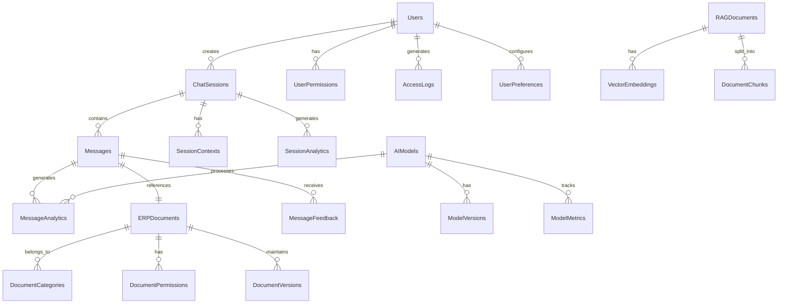

# ERP 챗봇 서비스 ERD 설계서

## 1. 데이터베이스 설계 개요

### 1.1 설계 원칙
- MariaDB 10.6 이상 버전 사용
- InnoDB 스토리지 엔진 사용
- UTF-8mb4 문자셋 사용
- 외래키 제약조건 활용
- 인덱스 최적화 고려

## 2. 전체 ERD 다이어그램



## 3. 테이블 상세 정의

### 3.1 사용자 관리
1. **Users (사용자)**
   ```sql
   CREATE TABLE users (
       user_id VARCHAR(36) PRIMARY KEY,
       email VARCHAR(100) UNIQUE NOT NULL,
       password_hash VARCHAR(256) NOT NULL,
       name VARCHAR(50) NOT NULL,
       department VARCHAR(50),
       position VARCHAR(50),
       status ENUM('active', 'inactive', 'suspended') NOT NULL,
       created_at TIMESTAMP NOT NULL DEFAULT CURRENT_TIMESTAMP,
       updated_at TIMESTAMP NOT NULL DEFAULT CURRENT_TIMESTAMP ON UPDATE CURRENT_TIMESTAMP,
       last_login_at TIMESTAMP,
       CONSTRAINT valid_email CHECK (email REGEXP '^[A-Za-z0-9._%+-]+@[A-Za-z0-9.-]+\.[A-Za-z]{2,}$')
   );
   ```

2. **UserPermissions (사용자 권한)**
   ```sql
   CREATE TABLE user_permissions (
       permission_id VARCHAR(36) PRIMARY KEY,
       user_id VARCHAR(36) NOT NULL,
       permission_type VARCHAR(50) NOT NULL,
       resource_type VARCHAR(50) NOT NULL,
       resource_id VARCHAR(36),
       access_level ENUM('read', 'write', 'admin') NOT NULL,
       granted_at TIMESTAMP NOT NULL DEFAULT CURRENT_TIMESTAMP,
       granted_by VARCHAR(36) NOT NULL,
       expires_at TIMESTAMP,
       FOREIGN KEY (user_id) REFERENCES users(user_id),
       FOREIGN KEY (granted_by) REFERENCES users(user_id)
   );
   ```

### 3.2 채팅 관리
1. **ChatSessions (채팅 세션)**
   ```sql
   CREATE TABLE chat_sessions (
       session_id VARCHAR(36) PRIMARY KEY,
       user_id VARCHAR(36) NOT NULL,
       title VARCHAR(100) NOT NULL,
       status ENUM('active', 'closed', 'archived') NOT NULL,
       created_at TIMESTAMP NOT NULL DEFAULT CURRENT_TIMESTAMP,
       updated_at TIMESTAMP NOT NULL DEFAULT CURRENT_TIMESTAMP ON UPDATE CURRENT_TIMESTAMP,
       last_activity TIMESTAMP NOT NULL,
       context_data JSON,
       FOREIGN KEY (user_id) REFERENCES users(user_id)
   );
   ```

2. **Messages (메시지)**
   ```sql
   CREATE TABLE messages (
       message_id VARCHAR(36) PRIMARY KEY,
       session_id VARCHAR(36) NOT NULL,
       sender_type ENUM('user', 'bot') NOT NULL,
       content TEXT NOT NULL,
       created_at TIMESTAMP NOT NULL DEFAULT CURRENT_TIMESTAMP,
       intent VARCHAR(100),
       confidence FLOAT,
       metadata JSON,
       FOREIGN KEY (session_id) REFERENCES chat_sessions(session_id)
   );
   ```

### 3.3 AI 모델 관리
1. **AIModels (AI 모델)**
   ```sql
   CREATE TABLE ai_models (
       model_id VARCHAR(36) PRIMARY KEY,
       name VARCHAR(100) NOT NULL,
       version VARCHAR(20) NOT NULL,
       type ENUM('intent', 'response', 'embedding') NOT NULL,
       status ENUM('active', 'training', 'deprecated') NOT NULL,
       config JSON NOT NULL,
       created_at TIMESTAMP NOT NULL DEFAULT CURRENT_TIMESTAMP,
       updated_at TIMESTAMP NOT NULL DEFAULT CURRENT_TIMESTAMP ON UPDATE CURRENT_TIMESTAMP,
       UNIQUE KEY model_version (name, version)
   );
   ```

2. **ModelMetrics (모델 메트릭)**
   ```sql
   CREATE TABLE model_metrics (
       metric_id VARCHAR(36) PRIMARY KEY,
       model_id VARCHAR(36) NOT NULL,
       metric_type VARCHAR(50) NOT NULL,
       metric_value FLOAT NOT NULL,
       timestamp TIMESTAMP NOT NULL DEFAULT CURRENT_TIMESTAMP,
       metadata JSON,
       FOREIGN KEY (model_id) REFERENCES ai_models(model_id)
   );
   ```

### 3.4 지식베이스 관리
1. **RAGDocuments (RAG 문서)**
   ```sql
   CREATE TABLE rag_documents (
       document_id VARCHAR(36) PRIMARY KEY,
       title VARCHAR(200) NOT NULL,
       content TEXT NOT NULL,
       source_type VARCHAR(50) NOT NULL,
       metadata JSON NOT NULL,
       embedding_status ENUM('pending', 'processing', 'completed', 'failed') NOT NULL,
       created_at TIMESTAMP NOT NULL DEFAULT CURRENT_TIMESTAMP,
       updated_at TIMESTAMP NOT NULL DEFAULT CURRENT_TIMESTAMP ON UPDATE CURRENT_TIMESTAMP,
       last_processed TIMESTAMP,
       FULLTEXT INDEX idx_content (content)
   );
   ```

2. **VectorEmbeddings (벡터 임베딩)**
   ```sql
   CREATE TABLE vector_embeddings (
       embedding_id VARCHAR(36) PRIMARY KEY,
       document_id VARCHAR(36) NOT NULL,
       chunk_id VARCHAR(36) NOT NULL,
       vector VECTOR(1536), -- 벡터 데이터 타입은 DB에 따라 다름
       model_version VARCHAR(50) NOT NULL,
       created_at TIMESTAMP NOT NULL DEFAULT CURRENT_TIMESTAMP,
       FOREIGN KEY (document_id) REFERENCES rag_documents(document_id)
   );
   ```

## 4. 인덱스 설계

### 4.1 성능 최적화 인덱스
```sql
-- 사용자 조회 최적화
CREATE INDEX idx_users_email ON users(email);
CREATE INDEX idx_users_department ON users(department);

-- 세션 검색 최적화
CREATE INDEX idx_sessions_user ON chat_sessions(user_id, created_at);
CREATE INDEX idx_sessions_status ON chat_sessions(status, last_activity);

-- 메시지 검색 최적화
CREATE INDEX idx_messages_session ON messages(session_id, created_at);
CREATE INDEX idx_messages_intent ON messages(intent);

-- 벡터 검색 최적화
CREATE INDEX idx_embeddings_document ON vector_embeddings(document_id);
CREATE INDEX idx_embeddings_model ON vector_embeddings(model_version);
```

### 4.2 참조 무결성 제약조건
```sql
-- 사용자 삭제 시 관련 데이터 처리
ALTER TABLE chat_sessions
ADD CONSTRAINT fk_session_user
FOREIGN KEY (user_id) REFERENCES users(user_id)
ON DELETE CASCADE;

-- 세션 삭제 시 관련 메시지 처리
ALTER TABLE messages
ADD CONSTRAINT fk_message_session
FOREIGN KEY (session_id) REFERENCES chat_sessions(session_id)
ON DELETE CASCADE;
```

## 5. 데이터 마이그레이션

### 5.1 초기 데이터 설정
```sql
-- 기본 권한 설정
INSERT INTO user_permissions (permission_id, user_id, permission_type, resource_type, access_level)
VALUES
    (UUID(), 'admin', 'system', '*', 'admin'),
    (UUID(), 'default', 'chat', 'session', 'read');

-- 기본 AI 모델 설정
INSERT INTO ai_models (model_id, name, version, type, status, config)
VALUES
    (UUID(), 'intent-classifier', '1.0.0', 'intent', 'active', '{"threshold": 0.7}'),
    (UUID(), 'response-generator', '1.0.0', 'response', 'active', '{"temperature": 0.7}');
```

## 6. 용어 설명

### 6.1 데이터베이스 용어
- **ENUM**: 미리 정의된 값들 중 하나만 선택할 수 있는 데이터 타입
- **JSON**: 구조화된 데이터를 저장할 수 있는 데이터 타입
- **VECTOR**: 임베딩 벡터를 저장하기 위한 특수 데이터 타입

### 6.2 인덱스 용어
- **FULLTEXT INDEX**: 전문 검색을 위한 특수한 인덱스
- **FOREIGN KEY**: 테이블 간의 참조 무결성을 보장하는 제약조건 