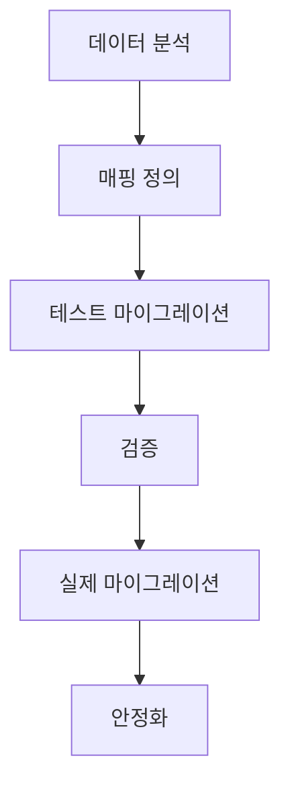

# 데이터 마이그레이션 계획

## 1. 마이그레이션 개요

### 1.1 마이그레이션 범위
- 대상 DB: MariaDB 10.6
- 문자셋: UTF-8mb4
- 스토리지 엔진: InnoDB
- 데이터 크기: 예상 500GB

### 1.2 목적
- ERP 시스템의 기존 데이터를 챗봇 서비스에 적합한 형태로 변환
- 데이터 정합성 보장
- 서비스 중단 최소화
- 롤백 계획 수립

### 1.3 대상 시스템
```yaml
소스 시스템:
  - 시스템명: ERP System
  - 데이터베이스: Oracle 19c
  - 문자셋: UTF-8
  - 데이터 크기: 약 500GB

대상 시스템:
  - 시스템명: ERP Chatbot
  - 데이터베이스: MariaDB 10.6
  - 문자셋: UTF-8mb4
  - 예상 데이터 크기: 약 200GB
```

## 2. 마이그레이션 전략

### 2.1 단계별 접근


### 2.2 데이터 매핑 정의
```yaml
# 사용자 데이터 매핑
ERP_USER:
  - SOURCE: USER_ID -> TARGET: user_id
  - SOURCE: EMAIL -> TARGET: email
  - SOURCE: DEPT_CODE -> TARGET: department
  변환규칙:
    - 부서코드 -> 부서명 변환
    - 비밀번호 재암호화 (bcrypt)
    - 상태값 매핑 (1:active, 2:inactive)

# 문서 데이터 매핑
ERP_DOCUMENT:
  - SOURCE: DOC_ID -> TARGET: document_id
  - SOURCE: TITLE -> TARGET: title
  - SOURCE: CONTENT -> TARGET: content
  변환규칙:
    - HTML 태그 제거
    - 첨부파일 경로 변환
    - 메타데이터 추출
```

## 3. 마이그레이션 절차

### 3.1 사전 준비
```python
class DataPreprocessor:
    def __init__(self):
        self.source_conn = create_source_connection()
        self.target_conn = create_target_connection()
        
    def clean_data(self, data: pd.DataFrame) -> pd.DataFrame:
        # 1. 중복 데이터 제거
        data = data.drop_duplicates()
        
        # 2. NULL 값 처리
        data = self.handle_null_values(data)
        
        # 3. 데이터 정규화
        data = self.normalize_data(data)
        
        # 4. 데이터 검증
        self.validate_data(data)
        
        return data
```

### 3.2 마이그레이션 스크립트
```sql
-- 1. 사용자 데이터 마이그레이션
INSERT INTO users (
    user_id,
    email,
    name,
    department,
    position,
    status
)
SELECT 
    USER_ID,
    EMAIL,
    USER_NAME,
    DEPT_NAME,
    POSITION_NAME,
    CASE 
        WHEN STATUS = '1' THEN 'active'
        WHEN STATUS = '2' THEN 'inactive'
        ELSE 'suspended'
    END
FROM ERP_USER
WHERE STATUS != '9';  -- 삭제된 계정 제외

-- 2. 문서 데이터 마이그레이션
INSERT INTO rag_documents (
    document_id,
    title,
    content,
    source_type,
    metadata
)
SELECT 
    DOC_ID,
    DOC_TITLE,
    REGEXP_REPLACE(DOC_CONTENT, '<[^>]+>', ''), -- HTML 태그 제거
    'erp_manual',
    JSON_BUILD_OBJECT(
        'category', DOC_CATEGORY,
        'author', CREATOR_ID,
        'created_date', CREATE_DATE
    )
FROM ERP_DOCUMENT
WHERE DOC_STATUS = 'PUBLISHED';
```

### 3.3 데이터 검증
```python
class DataValidator:
    def validate_migration(self):
        # 1. 레코드 수 검증
        self.validate_record_counts()
        
        # 2. 데이터 정합성 검증
        self.validate_data_integrity()
        
        # 3. 참조 무결성 검증
        self.validate_referential_integrity()
        
    def validate_record_counts(self):
        source_counts = self.get_source_counts()
        target_counts = self.get_target_counts()
        
        for table, count in source_counts.items():
            if count != target_counts[table]:
                raise ValidationError(f"Count mismatch in {table}")
                
    def validate_data_integrity(self):
        queries = [
            """
            SELECT u.user_id, u.email, eu.EMAIL
            FROM users u
            LEFT JOIN ERP_USER eu ON u.user_id = eu.USER_ID
            WHERE u.email != eu.EMAIL
            """
        ]
        
        for query in queries:
            results = self.execute_validation_query(query)
            if results:
                raise ValidationError(f"Data integrity error: {results}")
```

## 4. 롤백 계획

### 4.1 롤백 트리거 조건
```yaml
롤백 기준:
  - 데이터 검증 실패율 1% 초과
  - 핵심 기능 오작동
  - 성능 저하 (응답시간 2배 이상)
  - 보안 취약점 발견

롤백 절차:
  1. 롤백 결정 및 승인
  2. 사용자 공지
  3. 서비스 중단
  4. 백업 데이터 복원
  5. 시스템 재시작
  6. 검증 테스트
  7. 서비스 재개
```

### 4.2 복구 스크립트
```bash
#!/bin/bash
# rollback.sh

# 1. 서비스 중단
systemctl stop erp-chatbot

# 2. 백업 복원
psql -U postgres -d erp_chatbot -f backup/pre_migration.sql

# 3. 데이터 검증
python validate_data.py

# 4. 서비스 재시작
systemctl start erp-chatbot

# 5. 상태 확인
curl -f http://localhost:8080/health || exit 1
```

## 5. 용어 설명

### 5.1 기술 용어
- **ETL (Extract, Transform, Load)**: 데이터 추출, 변환, 적재 프로세스
- **CDC (Change Data Capture)**: 데이터 변경 사항을 실시간으로 감지하는 기술
- **데이터 정규화**: 데이터의 중복을 최소화하고 일관성을 보장하는 과정

### 5.2 마이그레이션 용어
- **소스 시스템**: 데이터를 추출할 원본 시스템
- **타겟 시스템**: 데이터를 이관할 대상 시스템
- **데이터 매핑**: 원본 데이터와 대상 데이터의 필드를 매칭하는 작업 