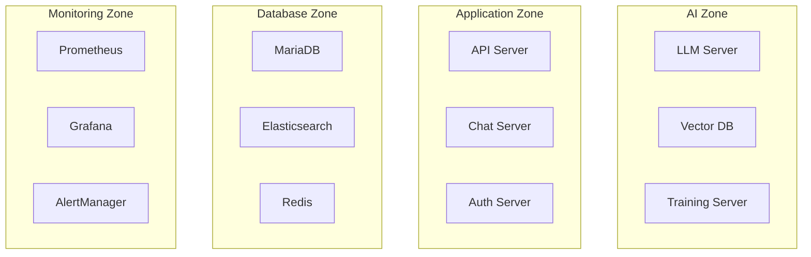

# 인프라 구축 계획서

## 1. 인프라 구성 개요

### 1.1 하드웨어 구성
```yaml
베어본 서버:
  CPU: Intel Xeon Scalable
  GPU: NVIDIA RTX 4000 Ada × 4
  Memory: 256GB
  Storage: 4TB NVMe SSD
  네트워크: 10Gbps
```

### 1.2 리소스 할당
```yaml
리소스 할당:
  AI 시스템:
    GPU: NVIDIA RTX 4000 Ada × 3
    Memory: 128GB
    Storage: 2TB
    용도:
      - LLM 추론
      - 벡터 검색
      - 모델 학습
    
  애플리케이션/DB:
    GPU: NVIDIA RTX 4000 Ada × 1
    Memory: 128GB
    Storage: 2TB
    용도:
      - API 서버
      - 데이터베이스
      - 캐시/검색엔진
```

## 2. 컨테이너 구성

### 2.1 Docker 컨테이너 구조


### 2.2 컨테이너 리소스 할당
```yaml
컨테이너 할당:
  AI 서비스:
    llm-server:
      memory: 64GB
      gpu: "device=0,1"
    vector-db:
      memory: 32GB
      gpu: "device=2"
    training-server:
      memory: 32GB
      gpu: "device=2"
      
  애플리케이션:
    api-server:
      memory: 16GB
      gpu: "device=3"
    chat-server:
      memory: 8GB
    auth-server:
      memory: 4GB
      
  데이터베이스:
    mariadb:
      memory: 64GB
    elasticsearch:
      memory: 32GB
    redis:
      memory: 16GB
      
  모니터링:
    prometheus:
      memory: 8GB
    grafana:
      memory: 4GB
    alertmanager:
      memory: 2GB
```

## 3. 데이터베이스 구성

### 3.1 MariaDB 설정
```yaml
MariaDB 설정:
  버전: 10.6
  설정:
    innodb_buffer_pool_size: 48GB
    innodb_log_file_size: 1GB
    max_connections: 1000
    thread_cache_size: 128
    
  백업:
    도구: mariabackup
    주기: 매일 02:00
    보관: 30일
    방식: 증분 백업
```

### 3.2 Redis 설정
```yaml
Redis 설정:
  버전: 6.2
  메모리: 16GB
  설정:
    maxmemory-policy: allkeys-lru
    save: "900 1 300 10 60 10000"
    appendonly: yes
```

## 4. 보안 구성

### 4.1 네트워크 보안
```yaml
보안 정책:
  외부 접근:
    - HTTPS(443): 웹 서비스
    - WSS(443): 웹소켓
    
  내부 통신:
    - 컨테이너 간: TLS 1.3
    - 서비스 메시: mTLS
    
  관리자 접근:
    - SSH(22): VPN 필수
    - 관리 포털(8443): VPN 필수
```

### 4.2 데이터 보안
```yaml
데이터 보안:
  암호화:
    - 전송 구간: TLS 1.3
    - 저장 데이터: AES-256
    
  접근 제어:
    - RBAC 기반 권한 관리
    - MFA 인증
    - 세션 관리
```

## 5. 모니터링 구성

### 5.1 시스템 모니터링
```yaml
모니터링 도구:
  - Prometheus
  - Grafana
  - Alertmanager
  
수집 메트릭:
  시스템:
    - CPU/GPU 사용률
    - 메모리 사용률
    - 디스크 I/O
    - 네트워크 트래픽
    
  애플리케이션:
    - API 응답시간
    - 에러율
    - 처리량
    - 동시접속자
```

### 5.2 로그 관리
```yaml
로그 수집:
  도구:
    - Filebeat
    - Elasticsearch
    - Kibana
    
  대상:
    - 애플리케이션 로그
    - 시스템 로그
    - 보안 감사 로그
    
  보관 정책:
    - 실시간 로그: 7일
    - 중요 로그: 1년
    - 감사 로그: 5년
```

## 6. 용어 설명

### 6.1 하드웨어 용어
- **베어본 서버**: 기본적인 하드웨어만 포함된 서버
- **RTX 4000 Ada**: NVIDIA의 고성능 GPU
- **NVMe**: 고성능 SSD를 위한 인터페이스 규격

### 6.2 소프트웨어 용어
- **Docker**: 컨테이너 가상화 플랫폼
- **MariaDB**: 오픈소스 관계형 데이터베이스
- **Redis**: 인메모리 캐시 데이터베이스