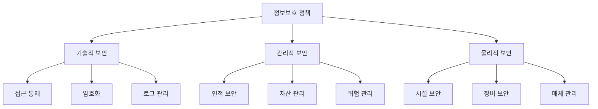

# 보안 정책

## 1. 보안 관리 체계

### 1.1 보안 조직
```yaml
# 보안 조직 구성
보안 조직:
  정보보호 위원회:
    - CISO (정보보호 최고책임자)
    - 보안 아키텍트
    - 개인정보보호 담당자
    - 시스템 보안 담당자
    - 네트워크 보안 담당자
    
  보안 운영팀:
    - 보안 관제 (24x7)
    - 취약점 진단
    - 침해사고 대응
    - 보안 감사

  개인정보보호팀:
    - 정책 수립
    - 교육 및 감사
    - 유출 대응
```

### 1.2 보안 정책 프레임워크


## 2. 접근 통제

### 2.1 인증 정책
```java
@Configuration
public class SecurityConfig {
    @Bean
    public SecurityFilterChain filterChain(HttpSecurity http) {
        return http
            .authorizeRequests()
                .antMatchers("/api/public/**").permitAll()
                .antMatchers("/api/admin/**").hasRole("ADMIN")
                .anyRequest().authenticated()
            .and()
            .oauth2Login()
                .userInfoEndpoint()
                    .userService(customOAuth2UserService)
            .and()
            .sessionManagement()
                .sessionCreationPolicy(SessionCreationPolicy.STATELESS)
            .and()
            .addFilterBefore(jwtAuthenticationFilter, UsernamePasswordAuthenticationFilter.class)
            .csrf().enable()
            .headers()
                .frameOptions().deny()
                .xssProtection().enable()
            .and()
            .build();
    }
    
    @Bean
    public PasswordEncoder passwordEncoder() {
        return new BCryptPasswordEncoder(12);
    }
}
```

### 2.2 권한 관리
```yaml
# authorization/rbac-policy.yml
roles:
  ADMIN:
    permissions:
      - "system:*"
      - "user:*"
      - "data:*"
    
  MANAGER:
    permissions:
      - "user:read"
      - "user:write"
      - "data:read"
    
  USER:
    permissions:
      - "user:read:self"
      - "data:read:self"

resources:
  system:
    - "config"
    - "audit"
    - "backup"
  
  user:
    - "profile"
    - "settings"
    - "history"
  
  data:
    - "documents"
    - "reports"
    - "analytics"
```

## 3. 데이터 보안

### 3.1 암호화 정책
```java
@Service
public class EncryptionService {
    private static final String ALGORITHM = "AES/GCM/NoPadding";
    private static final int TAG_LENGTH_BIT = 128;
    
    @Value("${encryption.key}")
    private String secretKey;
    
    public String encrypt(String data) {
        try {
            byte[] iv = generateIv();
            SecretKey key = generateKey(secretKey);
            
            Cipher cipher = Cipher.getInstance(ALGORITHM);
            GCMParameterSpec spec = new GCMParameterSpec(TAG_LENGTH_BIT, iv);
            
            cipher.init(Cipher.ENCRYPT_MODE, key, spec);
            byte[] encryptedData = cipher.doFinal(data.getBytes());
            
            return Base64.getEncoder().encodeToString(
                ByteBuffer.allocate(iv.length + encryptedData.length)
                    .put(iv)
                    .put(encryptedData)
                    .array()
            );
        } catch (Exception e) {
            throw new EncryptionException("Encryption failed", e);
        }
    }
}
```

### 3.2 개인정보 보호
```python
class PersonalDataProcessor:
    def __init__(self):
        self.masking_rules = {
            'ssn': r'(\d{6})-(\d{7})',
            'phone': r'(\d{3})-(\d{3,4})-(\d{4})',
            'email': r'([a-zA-Z0-9._%+-]+)@([a-zA-Z0-9.-]+\.[a-zA-Z]{2,})'
        }
        
    def mask_personal_data(self, data: str, data_type: str) -> str:
        if data_type not in self.masking_rules:
            return data
            
        pattern = self.masking_rules[data_type]
        
        if data_type == 'ssn':
            return re.sub(pattern, r'\1-*******', data)
        elif data_type == 'phone':
            return re.sub(pattern, r'\1-****-\3', data)
        elif data_type == 'email':
            return re.sub(pattern, r'***@\2', data)
```

## 4. 보안 모니터링

### 4.1 로그 수집 및 분석
```yaml
# filebeat/filebeat.yml
filebeat.inputs:
- type: log
  enabled: true
  paths:
    - /var/log/auth.log
    - /var/log/syslog
    - /var/log/application/*.log
  fields:
    log_type: system
    environment: production

processors:
  - add_host_metadata: ~
  - add_cloud_metadata: ~
  - add_docker_metadata: ~

output.elasticsearch:
  hosts: ["elasticsearch:9200"]
  index: "security-logs-%{+yyyy.MM.dd}"
```

### 4.2 보안 이벤트 탐지
```python
class SecurityEventDetector:
    def __init__(self):
        self.rules_engine = RulesEngine()
        self.alert_manager = AlertManager()
        
    async def analyze_events(self, events: List[Event]):
        for event in events:
            # 1. 이벤트 분류
            event_type = self.classify_event(event)
            
            # 2. 위험도 평가
            risk_score = self.assess_risk(event)
            
            # 3. 룰 매칭
            matched_rules = self.rules_engine.match(event)
            
            # 4. 알림 생성
            if matched_rules:
                await self.alert_manager.create_alert(
                    event=event,
                    rules=matched_rules,
                    risk_score=risk_score
                )
```

## 5. 보안 감사

### 5.1 감사 로그 정책
```yaml
# audit/audit-policy.yml
audit_rules:
  - resource: user_authentication
    events:
      - login
      - logout
      - login_failed
    retention: 1year
    
  - resource: data_access
    events:
      - read
      - write
      - delete
    retention: 6months
    
  - resource: system_config
    events:
      - modify
      - delete
    retention: 2years
```

### 5.2 컴플라이언스 점검
```python
class ComplianceChecker:
    def __init__(self):
        self.checklist = self.load_checklist()
        self.validator = ComplianceValidator()
        
    async def run_compliance_check(self):
        results = []
        
        # 1. 보안 정책 점검
        policy_result = await self.check_security_policies()
        results.append(policy_result)
        
        # 2. 접근 통제 점검
        access_result = await self.check_access_controls()
        results.append(access_result)
        
        # 3. 암호화 점검
        encryption_result = await self.check_encryption()
        results.append(encryption_result)
        
        # 4. 보고서 생성
        report = self.generate_compliance_report(results)
        
        return report
```

## 6. 용어 설명

### 6.1 보안 용어
- **CISO**: Chief Information Security Officer (정보보호 최고책임자)
- **RBAC**: Role Based Access Control (역할 기반 접근 제어)
- **IDS/IPS**: Intrusion Detection/Prevention System (침입 탐지/방지 시스템)

### 6.2 암호화 용어
- **AES-GCM**: Advanced Encryption Standard with Galois/Counter Mode
- **HSM**: Hardware Security Module (하드웨어 보안 모듈)
- **KMS**: Key Management System (키 관리 시스템) 