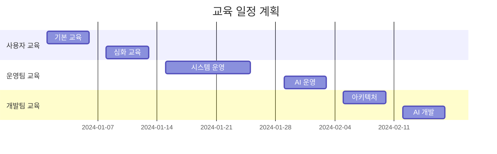

# 교육 계획서

## 1. 교육 체계

### 1.1 교육 대상 및 과정
```yaml
# 교육 과정 구성
교육 대상:
  사용자:
    - 일반 사용자
    - 부서 관리자
    - 시스템 관리자
    
  운영팀:
    - 시스템 운영자
    - AI 운영자
    - DB 운영자
    
  개발팀:
    - 백엔드 개발자
    - 프론트엔드 개발자
    - AI 엔지니어

교육 과정:
  기본 과정:
    - 시스템 개요
    - 기본 기능 사용법
    - 보안 정책
    
  심화 과정:
    - 고급 기능 활용
    - 문제 해결 방법
    - 성능 최적화
    
  전문가 과정:
    - 시스템 아키텍처
    - AI 모델 관리
    - 장애 대응
```

### 1.2 교육 일정


## 2. 교육 컨텐츠

### 2.1 사용자 교육 자료
```python
class UserTrainingContent:
    def __init__(self):
        self.contents = {
            '기본 과정': {
                '시스템 소개': {
                    'type': 'video',
                    'duration': '30min',
                    'topics': [
                        '시스템 개요',
                        '주요 기능 소개',
                        '접속 방법'
                    ]
                },
                '기본 기능': {
                    'type': 'hands-on',
                    'duration': '2h',
                    'topics': [
                        '대화 시작하기',
                        '정보 조회하기',
                        '결과 확인하기'
                    ]
                },
                '보안 정책': {
                    'type': 'document',
                    'topics': [
                        '보안 규정',
                        '개인정보 보호',
                        '접근 권한'
                    ]
                }
            }
        }
```

### 2.2 운영자 교육 자료
```yaml
# training/operator-course.yml
운영자 교육:
  시스템 운영:
    인프라 관리:
      - 서버 관리
      - 네트워크 설정
      - 백업/복구
      
    모니터링:
      - 성능 모니터링
      - 로그 분석
      - 알림 설정
      
    장애 대응:
      - 장애 감지
      - 긴급 조치
      - 복구 절차
      
  AI 운영:
    모델 관리:
      - 모델 배포
      - 성능 모니터링
      - 버전 관리
      
    데이터 관리:
      - 데이터 수집
      - 전처리
      - 품질 관리
```

## 3. 교육 방법

### 3.1 교육 진행 방식
```python
class TrainingMethodology:
    def __init__(self):
        self.methods = {
            '온라인 교육': {
                'platform': 'LMS System',
                'features': [
                    '동영상 강의',
                    '실시간 웨비나',
                    '온라인 실습'
                ],
                'tools': [
                    'Zoom',
                    'Miro',
                    'Kahoot'
                ]
            },
            '오프라인 교육': {
                'location': '교육장',
                'features': [
                    '강의',
                    '실습',
                    '토론'
                ],
                'materials': [
                    '교재',
                    '실습 환경',
                    '평가 자료'
                ]
            },
            '혼합 교육': {
                'components': [
                    '온라인 사전 학습',
                    '오프라인 실습',
                    '온라인 평가'
                ]
            }
        }
```

### 3.2 평가 및 인증
```yaml
# training/evaluation.yml
평가 체계:
  이론 평가:
    방식: 온라인 테스트
    문항 수: 50문항
    합격 기준: 80점 이상
    
  실습 평가:
    방식: 실습 과제
    과제 수: 5개
    합격 기준: 모든 과제 완료
    
  인증 제도:
    레벨:
      - Basic: 기본 과정 수료
      - Advanced: 심화 과정 수료
      - Expert: 전문가 과정 수료
    
    유효 기간: 2년
    갱신 조건: 보수 교육 이수
```

## 4. 교육 효과 측정

### 4.1 평가 지표
```python
class TrainingEffectiveness:
    def __init__(self):
        self.metrics = {
            '만족도 평가': {
                'method': '설문조사',
                'timing': '교육 직후',
                'items': [
                    '교육 내용 만족도',
                    '강사 만족도',
                    '교육 환경 만족도'
                ]
            },
            '학습 성과 평가': {
                'method': '테스트',
                'timing': '교육 전/후',
                'items': [
                    '지식 향상도',
                    '실무 적용도',
                    '문제 해결 능력'
                ]
            },
            '업무 적용도': {
                'method': '현업 적용 조사',
                'timing': '교육 3개월 후',
                'items': [
                    '업무 효율성 향상',
                    '오류 감소율',
                    '사용자 만족도'
                ]
            }
        }
```

### 4.2 피드백 관리
```yaml
# training/feedback.yml
피드백 프로세스:
  수집 방법:
    - 교육 평가 설문
    - 실시간 피드백
    - 사후 인터뷰
    
  분석 항목:
    - 교육 내용 적절성
    - 교육 방법 효과성
    - 교육 환경 적합성
    
  개선 프로세스:
    - 피드백 분석
    - 개선점 도출
    - 교육 과정 개선
    - 효과성 검증
```

## 5. 용어 설명

### 5.1 교육 용어
- **LMS (Learning Management System)**: 학습 관리 시스템
- **블렌디드 러닝**: 온라인과 오프라인을 혼합한 학습 방식
- **마이크로 러닝**: 짧은 단위의 학습 콘텐츠를 활용한 학습 방식

### 5.2 평가 용어
- **형성 평가**: 학습 과정 중에 실시하는 평가
- **총괄 평가**: 학습 종료 후 실시하는 최종 평가
- **ROI (Return on Investment)**: 교육 투자 대비 효과 측정 