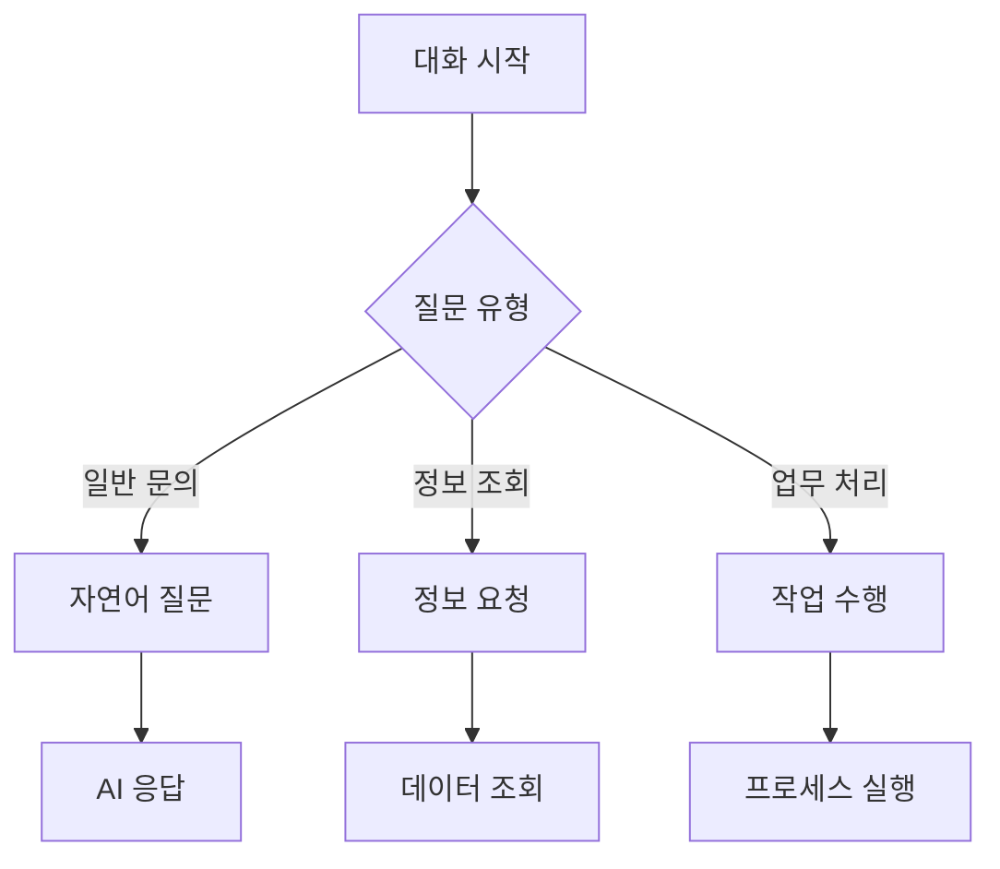

# 사용자 교육 매뉴얼

## 1. 챗봇 기본 사용법

### 1.1 시작하기
```yaml
# 접속 방법
접속 경로:
  웹: https://erp-chatbot.company.com
  모바일: ERP 챗봇 앱
  
로그인:
  - SSO 로그인 (사내 계정)
  - 2차 인증 (필요시)
  
초기 설정:
  - 알림 설정
  - 언어 설정
  - 테마 설정
```

### 1.2 기본 기능 안내


## 2. 주요 사용 시나리오

### 2.1 인사/급여 문의
```python
class HRScenarios:
    def show_examples(self):
        return {
            "급여 조회": [
                "이번 달 급여 명세서 보여줘",
                "지난달 급여 상세 내역이 궁금해",
                "올해 상여금 지급 내역 알려줘"
            ],
            "휴가 관리": [
                "남은 연차 일수 확인해줘",
                "다음 주 월요일 연차 신청하고 싶어",
                "휴가 신청 현황 보여줘"
            ],
            "인사 정보": [
                "우리 팀 조직도 보여줘",
                "홍길동 과장님 내선번호 알려줘",
                "올해 인사발령 이력 조회해줘"
            ]
        }
```

### 2.2 회계/재무 문의
```python
class FinanceScenarios:
    def show_examples(self):
        return {
            "전표 관리": [
                "지출결의서 작성 방법 알려줘",
                "이번 달 미결 전표 조회해줘",
                "전표 승인 상태 확인해줘"
            ],
            "예산 관리": [
                "우리 부서 예산 잔액 확인해줘",
                "프로젝트 예산 사용 현황 보여줘",
                "예산 초과 항목 알려줘"
            ],
            "결산 업무": [
                "월말 결산 일정 알려줘",
                "결산 마감 절차 설명해줘",
                "미결산 항목 조회해줘"
            ]
        }
```

## 3. 고급 기능 활용

### 3.1 데이터 분석 요청
```python
class AdvancedFeatures:
    def show_analytics_examples(self):
        return {
            "추세 분석": [
                "올해 월별 매출 추이 그래프로 보여줘",
                "부서별 인건비 비중 분석해줘",
                "지난 3개월 경비 사용 패턴 분석해줘"
            ],
            "비교 분석": [
                "작년 동기 대비 실적 비교해줘",
                "부서간 예산 집행률 비교해줘",
                "프로젝트별 수익성 분석해줘"
            ]
        }
```

### 3.2 자동화 업무 처리
```yaml
# 자동화 기능 예시
업무 자동화:
  보고서 생성:
    - 일일 실적 보고서
    - 주간 업무 보고서
    - 월간 성과 보고서
    
  일정 관리:
    - 회의 일정 조정
    - 업무 마감일 알림
    - 결재 기한 관리
    
  데이터 정리:
    - 중복 데이터 정리
    - 미사용 항목 정리
    - 데이터 포맷 변환
```

## 4. 문제 해결 가이드

### 4.1 자주 발생하는 문제
```yaml
# 문제 해결 절차
일반적인 문제:
  응답 지연:
    - 네트워크 상태 확인
    - 캐시 삭제
    - 브라우저 재시작
    
  로그인 문제:
    - SSO 상태 확인
    - 브라우저 쿠키 삭제
    - IT 지원팀 문의
    
  데이터 조회 오류:
    - 권한 확인
    - 필터 조건 확인
    - 시스템 관리자 문의
```

### 4.2 지원 요청 방법
```python
class SupportGuide:
    def get_support_channels(self):
        return {
            "일반 문의": {
                "채널": "챗봇 내 문의하기",
                "응답시간": "즉시~1시간",
                "담당": "AI 지원팀"
            },
            "기술 지원": {
                "채널": "IT 헬프데스크",
                "응답시간": "2시간 이내",
                "담당": "IT 지원팀"
            },
            "긴급 지원": {
                "채널": "비상 연락망",
                "응답시간": "15분 이내",
                "담당": "운영팀"
            }
        }
```

## 5. 용어 설명

### 5.1 시스템 용어
- **SSO (Single Sign-On)**: 한 번의 로그인으로 여러 시스템에 접근할 수 있는 인증 방식
- **캐시 (Cache)**: 자주 사용하는 데이터를 임시로 저장하여 빠르게 접근할 수 있게 하는 기능
- **대시보드 (Dashboard)**: 주요 정보를 한눈에 볼 수 있도록 구성된 화면

### 5.2 업무 용어
- **전표**: 회계상의 거래를 기록하는 기본 문서
- **결의서**: 지출이나 수입에 대한 승인을 받기 위한 문서
- **마감**: 특정 기간의 회계 처리를 완료하는 것 