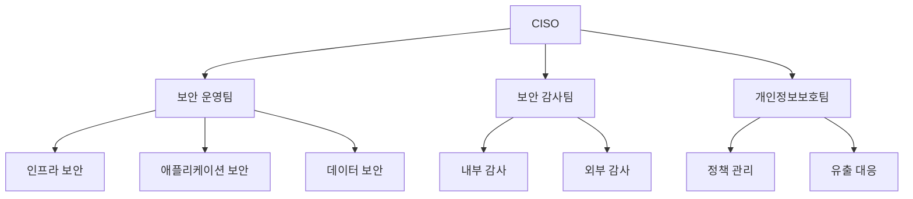

# 보안 교육 매뉴얼

## 1. 보안 정책 개요

### 1.1 보안 관리 체계
```yaml
# 보안 관리 프레임워크
보안 영역:
  접근 통제:
    - 사용자 인증
    - 권한 관리
    - 세션 관리
    
  데이터 보안:
    - 암호화
    - 마스킹
    - 백업/복구
    
  네트워크 보안:
    - 방화벽
    - VPN
    - 침입 탐지
    
  보안 감사:
    - 로그 기록
    - 모니터링
    - 감사 추적
```

### 1.2 보안 조직 구성


## 2. 접근 통제 관리

### 2.1 사용자 인증
```python
class AuthenticationManager:
    def __init__(self):
        self.auth_methods = {
            'password': PasswordAuthenticator(),
            'mfa': MFAAuthenticator(),
            'sso': SSOAuthenticator()
        }
        
    def authenticate_user(self, credentials: Dict):
        # 1. 기본 인증
        user = self.auth_methods['password'].authenticate(
            credentials['username'],
            credentials['password']
        )
        
        # 2. MFA 검증
        if user.requires_mfa:
            mfa_result = self.auth_methods['mfa'].verify(
                user,
                credentials['mfa_code']
            )
            if not mfa_result.is_valid:
                raise MFAVerificationError()
                
        # 3. 세션 생성
        return self.create_session(user)
```

### 2.2 권한 관리
```java
@Service
public class RBACManager {
    private final RoleRepository roleRepo;
    private final PermissionValidator validator;
    
    public boolean checkPermission(User user, String resource, String action) {
        // 1. 사용자 역할 확인
        Set<Role> roles = user.getRoles();
        
        // 2. 권한 검증
        for (Role role : roles) {
            if (validator.hasPermission(role, resource, action)) {
                return true;
            }
        }
        
        // 3. 접근 로그 기록
        auditLogger.logAccess(
            user, resource, action, false
        );
        
        return false;
    }
}
```

## 3. 데이터 보안

### 3.1 암호화 처리
```python
class DataEncryption:
    def __init__(self):
        self.key_manager = KeyManager()
        self.cipher = AESCipher()
        
    def encrypt_sensitive_data(self, data: Dict) -> Dict:
        # 1. 암호화 키 획득
        encryption_key = self.key_manager.get_current_key()
        
        # 2. 필드별 암호화
        encrypted_data = {}
        for field, value in data.items():
            if self.is_sensitive_field(field):
                encrypted_data[field] = self.cipher.encrypt(
                    value,
                    encryption_key
                )
            else:
                encrypted_data[field] = value
                
        return encrypted_data
```

### 3.2 데이터 마스킹
```python
class DataMasking:
    def __init__(self):
        self.masking_rules = {
            'ssn': r'(\d{6})-(\d{7})',
            'phone': r'(\d{3})-(\d{3,4})-(\d{4})',
            'email': r'([a-zA-Z0-9._%+-]+)@([a-zA-Z0-9.-]+\.[a-zA-Z]{2,})'
        }
        
    def apply_masking(self, data: str, data_type: str) -> str:
        if data_type not in self.masking_rules:
            return data
            
        pattern = self.masking_rules[data_type]
        
        if data_type == 'ssn':
            return re.sub(pattern, r'\1-*******', data)
        elif data_type == 'phone':
            return re.sub(pattern, r'\1-****-\3', data)
        elif data_type == 'email':
            return re.sub(pattern, r'***@\2', data)
```

## 4. 보안 모니터링

### 4.1 로그 모니터링
```python
class SecurityMonitor:
    def __init__(self):
        self.log_analyzer = LogAnalyzer()
        self.alert_manager = AlertManager()
        
    def monitor_security_events(self):
        # 1. 로그 수집
        security_logs = self.log_analyzer.collect_logs([
            'auth_logs',
            'access_logs',
            'audit_logs'
        ])
        
        # 2. 이상 탐지
        anomalies = self.detect_anomalies(security_logs)
        
        # 3. 알림 발송
        if anomalies:
            self.alert_manager.send_alerts(anomalies)
            
        # 4. 보고서 생성
        self.generate_security_report(security_logs)
```

### 4.2 침입 탐지
```python
class IntrusionDetection:
    def __init__(self):
        self.rules_engine = RulesEngine()
        self.blacklist = IPBlacklist()
        
    def analyze_traffic(self, traffic_data: Dict):
        # 1. 규칙 기반 검사
        rule_violations = self.rules_engine.check_rules(
            traffic_data
        )
        
        # 2. 블랙리스트 확인
        blacklist_matches = self.blacklist.check_ip(
            traffic_data['source_ip']
        )
        
        # 3. 대응 조치
        if rule_violations or blacklist_matches:
            self.take_action(traffic_data)
```

## 5. 보안 사고 대응

### 5.1 사고 대응 절차
```yaml
# incident/response-plan.yml
대응 절차:
  탐지 단계:
    - 이상 징후 감지
    - 초기 분석
    - 심각도 평가
    
  대응 단계:
    - 즉시 대응
    - 피해 최소화
    - 증거 수집
    
  복구 단계:
    - 시스템 복구
    - 서비스 정상화
    - 재발 방지
```

### 5.2 보고 체계
```python
class IncidentReporter:
    def __init__(self):
        self.notification = NotificationService()
        self.report_generator = ReportGenerator()
        
    def report_incident(self, incident: SecurityIncident):
        # 1. 초기 보고
        self.send_initial_report(incident)
        
        # 2. 상세 분석
        analysis = self.analyze_incident(incident)
        
        # 3. 최종 보고서
        report = self.report_generator.create_report(
            incident=incident,
            analysis=analysis
        )
        
        # 4. 이해관계자 통지
        self.notify_stakeholders(report)
```

## 6. 용어 설명

### 6.1 보안 용어
- **RBAC**: Role Based Access Control, 역할 기반 접근 제어
- **MFA**: Multi-Factor Authentication, 다중 인증
- **IDS/IPS**: 침입 탐지/방지 시스템

### 6.2 암호화 용어
- **AES**: Advanced Encryption Standard, 대칭키 암호화 알고리즘
- **RSA**: 비대칭키 암호화 알고리즘
- **Hash**: 단방향 암호화 함수 