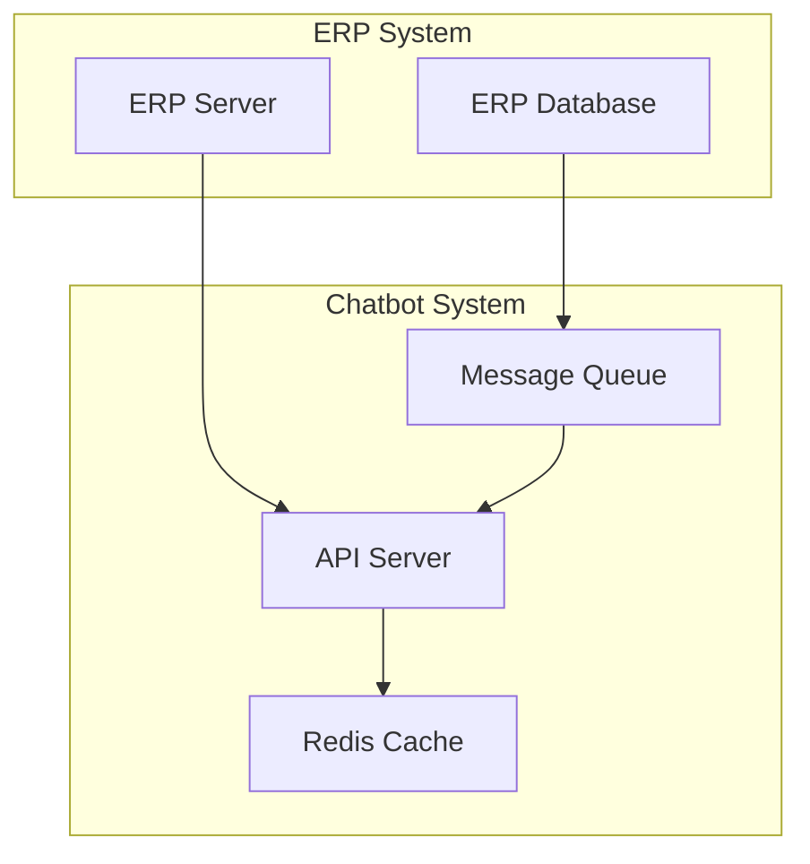

# ERP 연동 매뉴얼

## 1. 연동 구성

### 1.1 시스템 구성
```yaml
연동 서버:
  CPU: Intel Xeon Scalable
  Memory: 16GB
  Storage: 100GB
  네트워크: 10Gbps

연동 컨테이너:
  api-server:
    memory: 8GB
    gpu: "device=3"
    ports:
      - "8080:8080"
```

### 1.2 연동 아키텍처


## 2. 데이터 동기화

### 2.1 CDC(Change Data Capture) 설정
```python
class ERPDataSynchronizer:
    def __init__(self):
        self.cdc_connector = CDCConnector()
        self.queue = MessageQueue()
        self.cache = RedisCache()
        
    async def sync_data(self):
        # 1. CDC 이벤트 수신
        events = await self.cdc_connector.get_events()
        
        # 2. 데이터 변환
        transformed_data = self.transform_data(events)
        
        # 3. 캐시 업데이트
        await self.cache.update(transformed_data)
        
        # 4. 메시지 큐 전송
        await self.queue.publish(transformed_data)
```

### 2.2 캐시 관리
```python
class ERPCacheManager:
    def __init__(self):
        self.redis = Redis()
        self.config = {
            'user_data': {'ttl': 3600},    # 1시간
            'dept_data': {'ttl': 86400},   # 24시간
            'code_data': {'ttl': 604800}   # 7일
        }
        
    async def manage_cache(self):
        # 1. 캐시 상태 확인
        cache_status = await self.check_cache_status()
        
        # 2. 만료 데이터 갱신
        if cache_status.needs_refresh:
            await self.refresh_cache()
            
        # 3. 캐시 정리
        if cache_status.needs_cleanup:
            await self.cleanup_cache()
```

## 3. API 연동

### 3.1 API 클라이언트
```python
class ERPAPIClient:
    def __init__(self):
        self.base_url = "https://erp-api.company.com"
        self.auth = TokenAuth()
        self.retry = RetryWithBackoff(max_retries=3)
        
    async def call_api(self, endpoint: str, params: dict):
        try:
            # 1. 토큰 검증
            token = await self.auth.get_valid_token()
            
            # 2. API 호출
            response = await self.retry.call(
                method="GET",
                url=f"{self.base_url}/{endpoint}",
                headers={"Authorization": f"Bearer {token}"},
                params=params
            )
            
            # 3. 응답 처리
            return self.process_response(response)
            
        except Exception as e:
            await self.handle_api_error(e)
```

### 3.2 에러 처리
```python
class ERPErrorHandler:
    def __init__(self):
        self.alert = AlertManager()
        self.logger = ErrorLogger()
        
    async def handle_error(self, error: Exception):
        # 1. 에러 분류
        error_type = self.classify_error(error)
        
        # 2. 로깅
        await self.logger.log_error(
            error=error,
            context=self.get_error_context()
        )
        
        # 3. 알림 발송
        if error_type.is_critical:
            await self.alert.send_alert(
                level="critical",
                message=str(error)
            )
            
        # 4. 복구 시도
        await self.attempt_recovery(error_type)
```

## 4. 성능 최적화

### 4.1 연결 풀링
```yaml
커넥션 풀 설정:
  데이터베이스:
    최소 연결: 5
    최대 연결: 20
    유휴 타임아웃: 300초
    
  API 클라이언트:
    최소 연결: 10
    최대 연결: 50
    연결 타임아웃: 5초
    요청 타임아웃: 10초
```

### 4.2 캐시 최적화
```python
class CacheOptimizer:
    def __init__(self):
        self.redis = Redis()
        self.metrics = CacheMetrics()
        
    async def optimize_cache(self):
        # 1. 캐시 사용량 분석
        usage = await self.metrics.analyze_usage()
        
        # 2. 캐시 정책 조정
        if usage.hit_rate < 0.8:  # 80% 미만
            await self.adjust_cache_policy()
            
        # 3. 메모리 관리
        if usage.memory > 0.9:  # 90% 초과
            await self.cleanup_old_entries()
```

## 5. 모니터링

### 5.1 연동 상태 모니터링
```yaml
모니터링 항목:
  API 연동:
    - 응답시간
    - 에러율
    - TPS
    임계치:
      응답시간: 2초
      에러율: 1%
      
  데이터 동기화:
    - 지연시간
    - 동기화 실패율
    - 데이터 불일치
    임계치:
      지연시간: 5분
      실패율: 0.1%
```

### 5.2 알림 설정
```yaml
알림 규칙:
  Critical:
    - API 연동 실패
    - 데이터 동기화 중단
    - 보안 위반
    채널:
      - 전화
      - SMS
      - Slack (@channel)
      
  Warning:
    - 응답 지연
    - 동기화 지연
    - 캐시 부하
    채널:
      - Slack (@here)
      - Email
```

## 6. 용어 설명

### 6.1 연동 용어
- **CDC**: Change Data Capture, 데이터 변경 감지 및 전파
- **API**: Application Programming Interface, 애플리케이션 간 통신 인터페이스
- **캐시**: 자주 사용하는 데이터를 메모리에 저장하여 성능을 향상시키는 기술

### 6.2 성능 용어
- **TPS**: Transactions Per Second, 초당 처리 건수
- **레이턴시**: 요청부터 응답까지 걸리는 시간
- **처리량**: 단위 시간당 처리할 수 있는 요청의 수