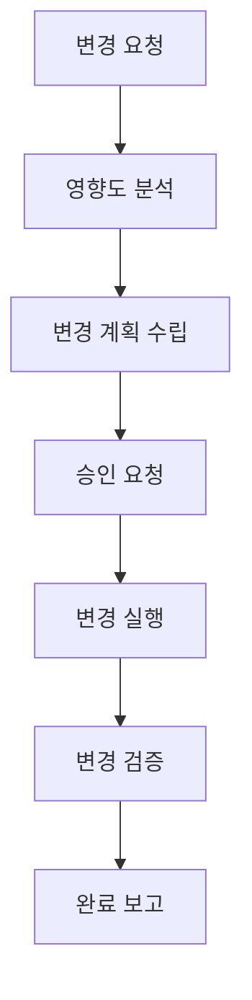

# 변경 관리 매뉴얼

## 1. 변경 관리 체계

### 1.1 변경 유형 정의
```yaml
변경 유형:
  긴급 변경:
    - 서비스 중단 해결
    - 보안 취약점 패치
    - 데이터 손실 방지
    승인: 즉시 승인 (사후 보고)
    
  일반 변경:
    - 기능 개선/추가
    - 성능 최적화
    - 정기 업데이트
    승인: 변경관리위원회
    
  표준 변경:
    - 정기 패치
    - 설정 변경
    - 일상적 유지보수
    승인: 담당자 승인
```

### 1.2 변경 프로세스


## 2. 변경 관리 절차

### 2.1 변경 요청
```python
class ChangeRequest:
    def __init__(self):
        self.request_manager = RequestManager()
        self.impact_analyzer = ImpactAnalyzer()
        
    async def create_change_request(self, request: dict):
        # 1. 요청 정보 검증
        validation = self.validate_request(request)
        if not validation.is_valid:
            raise ValidationError(validation.errors)
            
        # 2. 영향도 분석
        impact = await self.impact_analyzer.analyze(request)
        
        # 3. 변경 유형 결정
        change_type = self.determine_change_type(impact)
        
        # 4. 요청 등록
        return await self.request_manager.create(
            request=request,
            impact=impact,
            change_type=change_type
        )
```

### 2.2 변경 계획
```python
class ChangePlanner:
    def __init__(self):
        self.backup = BackupManager()
        self.resource = ResourceManager()
        
    async def create_change_plan(self, request: ChangeRequest):
        try:
            # 1. 리소스 확인
            resources = await self.resource.check_availability()
            
            # 2. 백업 계획
            backup_plan = await self.backup.create_plan()
            
            # 3. 실행 계획 수립
            execution_plan = self.create_execution_plan(
                request=request,
                resources=resources,
                backup=backup_plan
            )
            
            # 4. 롤백 계획 수립
            rollback_plan = self.create_rollback_plan(execution_plan)
            
            return ChangeImplementationPlan(
                execution_plan=execution_plan,
                rollback_plan=rollback_plan
            )
            
        except Exception as e:
            await self.handle_planning_error(e)
```

## 3. 변경 실행

### 3.1 사전 점검
```yaml
점검 항목:
  시스템 상태:
    - CPU/메모리/디스크 사용률
    - 프로세스 상태
    - 네트워크 상태
    
  백업 상태:
    - 최신 백업 확인
    - 복구 테스트
    - 저장 공간 확인
    
  리소스 확보:
    - 필요 리소스 확인
    - 여유 공간 확보
    - 의존성 검증
```

### 3.2 변경 실행
```python
class ChangeExecutor:
    def __init__(self):
        self.deployment = DeploymentManager()
        self.monitor = ChangeMonitor()
        
    async def execute_change(self, plan: ChangePlan):
        try:
            # 1. 사전 점검
            await self.pre_check()
            
            # 2. 백업 실행
            await self.backup.execute()
            
            # 3. 변경 실행
            result = await self.deployment.execute(plan)
            
            # 4. 변경 검증
            validation = await self.validate_change(result)
            if not validation.is_successful:
                await self.rollback(plan)
                raise ValidationError(validation.errors)
                
            return result
            
        except Exception as e:
            await self.handle_execution_failure(e)
```

## 4. 변경 검증

### 4.1 검증 항목
```yaml
검증 항목:
  기능 검증:
    - API 정상 동작
    - 데이터 처리
    - 권한 설정
    
  성능 검증:
    - 응답시간
    - 처리량
    - 리소스 사용률
    
  보안 검증:
    - 취약점 점검
    - 접근 통제
    - 로그 감사
```

### 4.2 모니터링 강화
```python
class ChangeMonitor:
    def __init__(self):
        self.metrics = MetricsCollector()
        self.alert = AlertManager()
        
    async def monitor_change(self):
        # 1. 메트릭 수집
        metrics = await self.metrics.collect([
            'system_health',
            'application_performance',
            'error_rate'
        ])
        
        # 2. 임계치 확인
        if self.detect_anomaly(metrics):
            await self.alert.send_alert(
                level='warning',
                message='변경 후 이상 징후 감지'
            )
            
        # 3. 로그 분석
        await self.analyze_logs()
```

## 5. 용어 설명

### 5.1 변경 관리 용어
- **변경 요청**: 시스템 변경을 위한 공식적인 요청
- **영향도 분석**: 변경이 시스템에 미치는 영향을 평가하는 과정
- **롤백 계획**: 변경 실패 시 이전 상태로 되돌리기 위한 계획

### 5.2 시스템 용어
- **배포**: 새로운 버전의 소프트웨어를 시스템에 적용하는 과정
- **패치**: 시스템의 문제를 해결하기 위한 수정사항
- **핫픽스**: 긴급한 문제 해결을 위한 즉각적인 수정