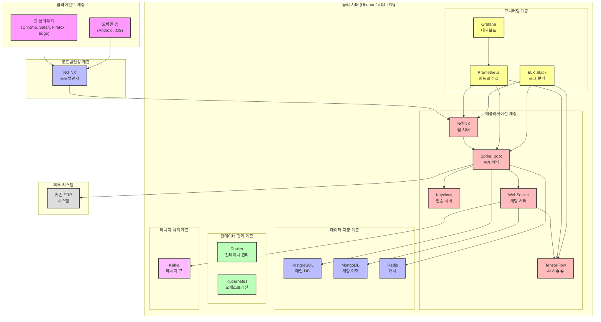
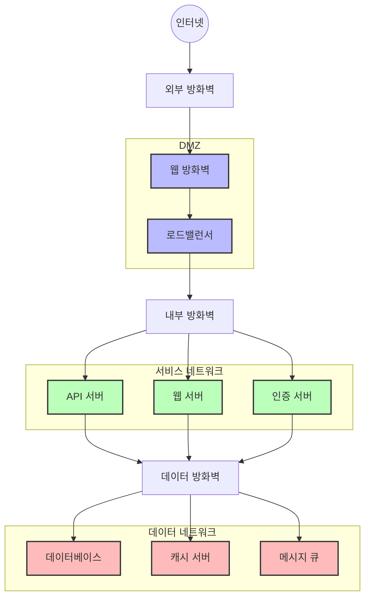
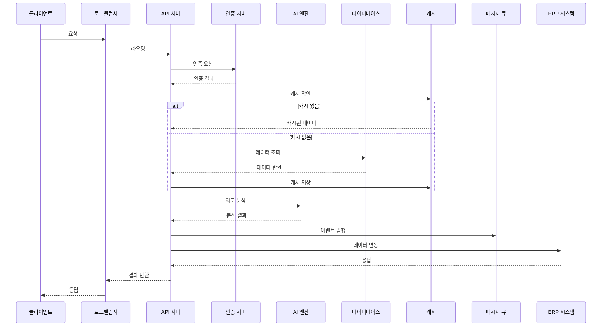

# 시스템 구성도

## 1. 전체 시스템 구성

## 2. 네트워크 구성도

### 2.1 네트워크 보안 구성
- **DMZ 구역**
  - 외부 접근 가능 영역
  - 웹 방화벽과 로드밸런서 배치
  - DDoS 방어 시스템 구축

- **서비스 네트워크**
  - 내부 서비스 영역
  - API, 웹, 인증 서버 배치
  - 내부 방화벽으로 보호

- **데이터 네트워크**
  - 데이터 저장 영역
  - 데이터베이스, 캐시, 메시지큐 배치
  - 데이터 방화벽으로 보호

## 3. 데이터 흐름도

### 3.1 주요 데이터 흐름
1. **사용자 요청 처리**
   - 클라이언트 요청 → 로드밸런서
   - 로드밸런서 → API 서버
   - 인증 및 권한 검증

2. **데이터 처리**
   - 캐시 확인 및 활용
   - 데이터베이스 조회/갱신
   - AI 엔진 분석 처리

3. **외부 시스템 연동**
   - ERP 시스템 데이터 연동
   - 메시지 큐를 통한 비동기 처리
   - 실시간 이벤트 처리