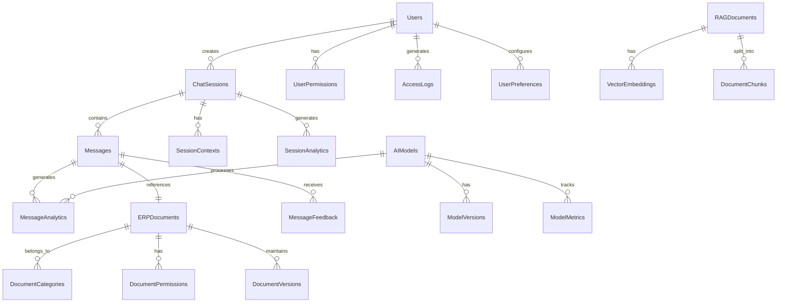

# ERP 챗봇 서비스 ERD 설계서

## 1. ERD 다이어그램

## 2. 테이블 상세 정의

### 2.1 Users (사용자)
| 컬럼명 | 데이터 타입 | 제약조건 | 설명 |
|--------|------------|-----------|------|
| user_id | VARCHAR(36) | PK | 사용자 고유 ID |
| email | VARCHAR(100) | UNIQUE, NOT NULL | 이메일 주소 |
| password_hash | VARCHAR(256) | NOT NULL | 암호화된 비밀번호 |
| name | VARCHAR(50) | NOT NULL | 사용자 이름 |
| department | VARCHAR(50) | | 부서명 |
| position | VARCHAR(50) | | 직급 |
| status | ENUM | NOT NULL | 활성/비활성 상태 |
| created_at | TIMESTAMP | NOT NULL | 생성일시 |
| updated_at | TIMESTAMP | NOT NULL | 수정일시 |

### 2.2 ChatSessions (채팅 세션)
| 컬럼명 | 데이터 타입 | 제약조건 | 설명 |
|--------|------------|-----------|------|
| session_id | VARCHAR(36) | PK | 세션 고유 ID |
| user_id | VARCHAR(36) | FK | 사용자 ID |
| title | VARCHAR(100) | NOT NULL | 세션 제목 |
| status | ENUM | NOT NULL | 진행중/종료 상태 |
| created_at | TIMESTAMP | NOT NULL | 생성일시 |
| updated_at | TIMESTAMP | NOT NULL | 수정일시 |
| last_activity | TIMESTAMP | NOT NULL | 마지막 활동 시간 |

### 2.3 Messages (메시지)
| 컬럼명 | 데이터 타입 | 제약조건 | 설명 |
|--------|------------|-----------|------|
| message_id | VARCHAR(36) | PK | 메시지 고유 ID |
| session_id | VARCHAR(36) | FK | 세션 ID |
| sender_type | ENUM | NOT NULL | 사용자/봇 구분 |
| content | TEXT | NOT NULL | 메시지 내용 |
| created_at | TIMESTAMP | NOT NULL | 생성일시 |
| is_processed | BOOLEAN | NOT NULL | AI 처리 완료 여부 |

### 2.4 ERPDocuments (ERP 문서)
| 컬럼명 | 데이터 타입 | 제약조건 | 설명 |
|--------|------------|-----------|------|
| document_id | VARCHAR(36) | PK | 문서 고유 ID |
| category_id | VARCHAR(36) | FK | 카테고리 ID |
| title | VARCHAR(200) | NOT NULL | 문서 제목 |
| content | TEXT | NOT NULL | 문서 내용 |
| created_at | TIMESTAMP | NOT NULL | 생성일시 |
| updated_at | TIMESTAMP | NOT NULL | 수정일시 |
| version | INTEGER | NOT NULL | 문서 버전 |

### 2.5 MessageAnalytics (메시지 분석)
| 컬럼명 | 데이터 타입 | 제약조건 | 설명 |
|--------|------------|-----------|------|
| analysis_id | VARCHAR(36) | PK | 분석 고유 ID |
| message_id | VARCHAR(36) | FK | 메시지 ID |
| model_id | VARCHAR(36) | FK | AI 모델 ID |
| intent | VARCHAR(100) | | 의도 분석 결과 |
| sentiment | FLOAT | | 감정 분석 점수 |
| entities | JSON | | 개체명 인식 결과 |
| confidence | FLOAT | NOT NULL | 신뢰도 점수 |

### 2.6 AIModels (AI 모델)
| 컬럼명 | 데이터 타입 | 제약조건 | 설명 |
|--------|------------|-----------|------|
| model_id | VARCHAR(36) | PK | 모델 고유 ID |
| name | VARCHAR(100) | NOT NULL | 모델명 |
| type | VARCHAR(50) | NOT NULL | 모델 유형 |
| status | ENUM | NOT NULL | 활성/비활성 상태 |
| current_version | VARCHAR(20) | NOT NULL | 현재 버전 |

### 2.7 UserPermissions (사용자 권한)
| 컬럼명 | 데이터 타입 | 제약조건 | 설명 |
|--------|------------|-----------|------|
| permission_id | VARCHAR(36) | PK | 권한 고유 ID |
| user_id | VARCHAR(36) | FK | 사용자 ID |
| permission_type | VARCHAR(50) | NOT NULL | 권한 유형 |
| granted_at | TIMESTAMP | NOT NULL | 권한 부여일시 |

### 2.8 AccessLogs (접근 로그)
| 컬럼명 | 데이터 타입 | 제약조건 | 설명 |
|--------|------------|-----------|------|
| log_id | VARCHAR(36) | PK | 로그 고유 ID |
| user_id | VARCHAR(36) | FK | 사용자 ID |
| action | VARCHAR(50) | NOT NULL | 수행 작업 |
| ip_address | VARCHAR(45) | NOT NULL | IP 주소 |
| timestamp | TIMESTAMP | NOT NULL | 발생일시 |
| details | JSON | | 추가 상세정보 |

### 2.9 RAGDocuments (RAG 문서)
| 컬럼명 | 데이터 타입 | 제약조건 | 설명 |
|--------|------------|-----------|------|
| document_id | VARCHAR(36) | PK | 문서 고유 ID |
| source_type | VARCHAR(50) | NOT NULL | 문서 출처 유형 |
| content | TEXT | NOT NULL | 원본 내용 |
| metadata | JSON | NOT NULL | 메타데이터 |
| embedding_status | ENUM | NOT NULL | 임베딩 상태 |
| last_processed | TIMESTAMP | NOT NULL | 마지막 처리 시간 |

### 2.10 VectorEmbeddings (벡터 임베딩)
| 컬럼명 | 데이터 타입 | 제약조건 | 설명 |
|--------|------------|-----------|------|
| embedding_id | VARCHAR(36) | PK | 임베딩 고유 ID |
| document_id | VARCHAR(36) | FK | RAG 문서 ID |
| chunk_id | VARCHAR(36) | FK | 청크 ID |
| vector | VECTOR(1536) | NOT NULL | 임베딩 벡터 |
| model_version | VARCHAR(50) | NOT NULL | 임베딩 모델 버전 |

## 3. 인덱스 정의

### 3.1 기본 인덱스
- 모든 PK 컬럼에 대한 클러스터형 인덱스
- 모든 FK 컬럼에 대한 비클러스터형 인덱스

### 3.2 추가 인덱스
1. Users
   - email (UNIQUE)
   - department, position (복합)

2. Messages
   - created_at
   - session_id, created_at (복합)

3. ERPDocuments
   - title (전문 검색)
   - category_id, created_at (복합)

4. AccessLogs
   - timestamp
   - user_id, timestamp (복합)

## 4. 데이터 관계 규칙

### 4.1 참조 무결성
- Users 삭제 시 관련 ChatSessions CASCADE
- ChatSessions 삭제 시 관련 Messages CASCADE
- 그 외 FK는 RESTRICT 설정

### 4.2 데이터 정합성
- 모든 TIMESTAMP는 UTC 기준
- 모든 상태값은 ENUM으로 관리
- JSON 필드는 스키마 검증 필요

## 5. 백업 및 복구 전략
1. 일일 전체 백업
2. 시간단위 증분 백업
3. 트랜잭션 로그 실시간 백업
4. 30일 백업 데이터 보관