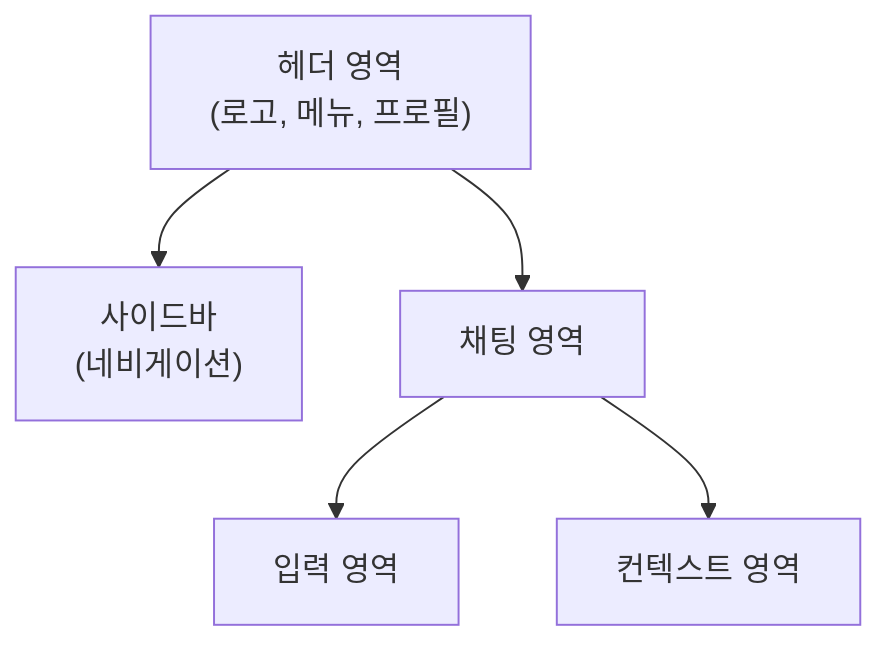
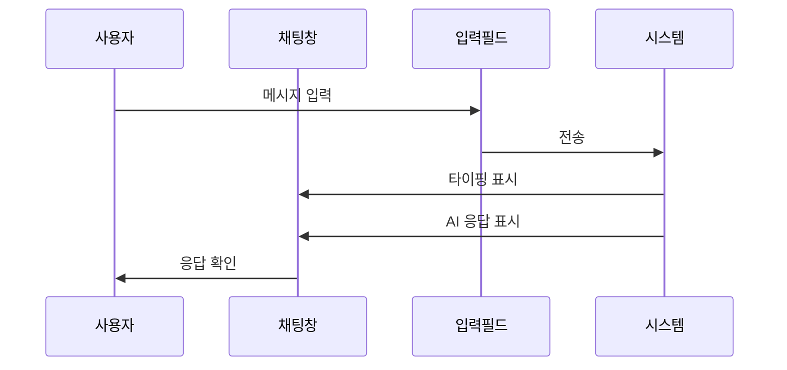

# ERP 챗봇 서비스 프로토타입 설계

## 1. 와이어프레임

### 1.1 메인 화면 레이아웃


### 1.2 채팅 인터페이스


## 2. 상호작용 설계

### 2.1 채팅 기능
- **메시지 입력**
  ```javascript
  // 메시지 입력 처리
  const handleMessageInput = (message) => {
    // 입력 유효성 검증
    if (!isValidMessage(message)) return;
    
    // 메시지 전송 애니메이션
    showSendingAnimation();
    
    // AI 응답 대기 표시
    showTypingIndicator();
  }
  ```

- **응답 표시**
  ```javascript
  // AI 응답 표시
  const displayResponse = (response) => {
    // 단계적 텍스트 표시
    response.split('\n').forEach((line, index) => {
      setTimeout(() => {
        appendMessageLine(line);
      }, index * 100);
    });
    
    // 코드 블록 하이라이팅
    highlightCodeBlocks();
  }
  ```

### 2.2 컨텍스트 메뉴
```html
<div class="context-menu">
  <!-- 대화 컨텍스트 -->
  <div class="context-history">
    <h3>현재 대화 주제</h3>
    <ul>
      <li>주문 처리 프로세스</li>
      <li>재고 관리</li>
    </ul>
  </div>
  
  <!-- 관련 문서 -->
  <div class="related-docs">
    <h3>참조 문서</h3>
    <ul>
      <li>주문 처리 매뉴얼</li>
      <li>재고 관리 지침</li>
    </ul>
  </div>
</div>
```

## 3. 반응형 디자인

### 3.1 브레이크포인트
```css
/* 데스크톱 (1200px 이상) */
@media (min-width: 1200px) {
  .chat-container {
    display: grid;
    grid-template-columns: 250px 1fr 300px;
  }
}

/* 태블릿 (768px ~ 1199px) */
@media (min-width: 768px) and (max-width: 1199px) {
  .chat-container {
    grid-template-columns: 200px 1fr;
  }
  .context-menu {
    position: fixed;
    right: 0;
    transform: translateX(100%);
  }
}

/* 모바일 (767px 이하) */
@media (max-width: 767px) {
  .chat-container {
    grid-template-columns: 1fr;
  }
  .sidebar {
    position: fixed;
    left: 0;
    transform: translateX(-100%);
  }
}
```

## 4. 접근성 구현

### 4.1 키보드 네비게이션
```javascript
// 키보드 네비게이션 처리
const handleKeyboardNav = (event) => {
  switch(event.key) {
    case 'Tab':
      // 포커스 이동
      moveFocusToNext();
      break;
    case 'Enter':
      // 선택 실행
      activateCurrentElement();
      break;
    case 'Escape':
      // 모달/팝업 닫기
      closeActiveModal();
      break;
  }
}
```

### 4.2 ARIA 레이블
```html
<!-- 접근성 마크업 예시 -->
<div role="main" aria-label="채팅 영역">
  <div role="log" aria-live="polite" class="chat-messages">
    <!-- 메시지 목록 -->
  </div>
  
  <div role="form" aria-label="메시지 입력">
    <input 
      type="text" 
      aria-label="메시지를 입력하세요"
      role="textbox"
    />
    <button 
      aria-label="전송"
      role="button"
    >전송</button>
  </div>
</div>
```

## 5. 애니메이션 및 전환 효과

### 5.1 메시지 전송 애니메이션
```css
/* 메시지 전송 애니메이션 */
.message-enter {
  opacity: 0;
  transform: translateY(20px);
}

.message-enter-active {
  opacity: 1;
  transform: translateY(0);
  transition: opacity 300ms, transform 300ms;
}

/* 타이핑 표시 애니메이션 */
.typing-indicator {
  display: flex;
  gap: 4px;
}

.typing-dot {
  animation: typing-bounce 1s infinite;
}

@keyframes typing-bounce {
  0%, 100% { transform: translateY(0); }
  50% { transform: translateY(-5px); }
}
```

## 6. 테마 시스템

### 6.1 색상 변수
```css
:root {
  /* 기본 테마 */
  --primary-color: #007AFF;
  --secondary-color: #5856D6;
  --background-color: #FFFFFF;
  --text-color: #000000;
  
  /* 다크 테마 */
  --dark-primary-color: #0A84FF;
  --dark-secondary-color: #5E5CE6;
  --dark-background-color: #000000;
  --dark-text-color: #FFFFFF;
}

/* 다크 모드 적용 */
@media (prefers-color-scheme: dark) {
  :root {
    --primary-color: var(--dark-primary-color);
    --background-color: var(--dark-background-color);
    --text-color: var(--dark-text-color);
  }
}
```