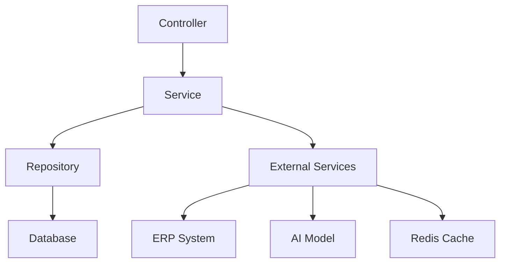

# ERP 챗봇 서비스 백엔드 서비스 레이어 설계

## 1. 서비스 계층 구조



## 2. 핵심 서비스 컴포넌트

### 2.1 AuthService
```typescript
interface AuthService {
    login(credentials: LoginDTO): Promise<TokenDTO>
    refreshToken(token: string): Promise<TokenDTO>
    validateToken(token: string): Promise<boolean>
    getUserPermissions(userId: string): Promise<Permission[]>
}
```

### 2.2 ChatService
```typescript
interface ChatService {
    createSession(userId: string): Promise<Session>
    sendMessage(sessionId: string, message: string): Promise<Message>
    getSessionHistory(sessionId: string): Promise<Message[]>
    analyzeIntent(message: string): Promise<IntentAnalysis>
    generateResponse(context: Context): Promise<Response>
}
```

### 2.3 ERPIntegrationService
```typescript
interface ERPIntegrationService {
    searchDocuments(query: string): Promise<Document[]>
    getUserInfo(userId: string): Promise<UserInfo>
    getBusinessData(type: string, params: any): Promise<any>
    syncData(entity: string): Promise<SyncResult>
}
```

### 2.4 AIModelService
```typescript
interface AIModelService {
    analyzeText(text: string): Promise<Analysis>
    generateSuggestions(context: Context): Promise<Suggestion[]>
    trainModel(data: TrainingData): Promise<TrainingResult>
    evaluateModel(): Promise<Metrics>
}
```

## 3. 서비스 레이어 구현 원칙

### 3.1 의존성 주입
- 인터페이스 기반 설계
- 생성자 주입 방식 사용
- 단위 테스트 용이성 확보

```typescript
class ChatServiceImpl implements ChatService {
    constructor(
        private readonly repository: ChatRepository,
        private readonly aiService: AIModelService,
        private readonly erpService: ERPIntegrationService
    ) {}
}
```

### 3.2 트랜잭션 관리
- 서비스 레이어에서 트랜잭션 경계 설정
- 선언적 트랜잭션 관리
- 롤백 정책 정의

```typescript
@Transactional
async createSession(userId: string): Promise<Session> {
    const session = await this.repository.create({ userId });
    await this.eventPublisher.publish('session.created', session);
    return session;
}
```

### 3.3 예외 처리
- 비즈니스 예외 정의
- 글로벌 예외 처리
- 예외 변환

```typescript
class BusinessException extends Error {
    constructor(
        public readonly code: string,
        message: string,
        public readonly details?: any
    ) {
        super(message);
    }
}
```

## 4. 비동기 처리

### 4.1 메시지 큐 통합
```typescript
interface MessageQueueService {
    publish(topic: string, message: any): Promise<void>
    subscribe(topic: string, handler: MessageHandler): void
}
```

### 4.2 이벤트 처리
```typescript
interface EventPublisher {
    publish(eventName: string, payload: any): Promise<void>
}

interface EventSubscriber {
    subscribe(eventName: string, handler: EventHandler): void
}
```

## 5. 캐싱 전략

### 5.1 캐시 서비스
```typescript
interface CacheService {
    get<T>(key: string): Promise<T | null>
    set<T>(key: string, value: T, ttl?: number): Promise<void>
    delete(key: string): Promise<void>
    clear(): Promise<void>
}
```

### 5.2 캐시 정책
- 사용자 세션 정보: 30분
- API 응답 캐시: 5분
- 설정 정보: 1시간

## 6. 로깅 및 모니터링

### 6.1 로깅 서비스
```typescript
interface LoggingService {
    info(message: string, context?: any): void
    error(error: Error, context?: any): void
    warn(message: string, context?: any): void
    debug(message: string, context?: any): void
}
```

### 6.2 메트릭 수집
```typescript
interface MetricsService {
    recordTiming(metric: string, value: number): void
    incrementCounter(metric: string): void
    recordValue(metric: string, value: number): void
}
```

## 7. 보안 처리

### 7.1 인증/인가
- JWT 기반 인증
- RBAC 기반 권한 관리
- API 엔드포인트 보안

### 7.2 데이터 암호화
- 중요 데이터 암호화
- 안전한 키 관리
- 통신 구간 암호화

## 8. 성능 최적화

### 8.1 쿼리 최적화
- N+1 문제 해결
- 인덱스 활용
- 페이지네이션 처리

### 8.2 리소스 관리
- 커넥션 풀 관리
- 스레드 풀 설정
- 메모리 사용 최적화