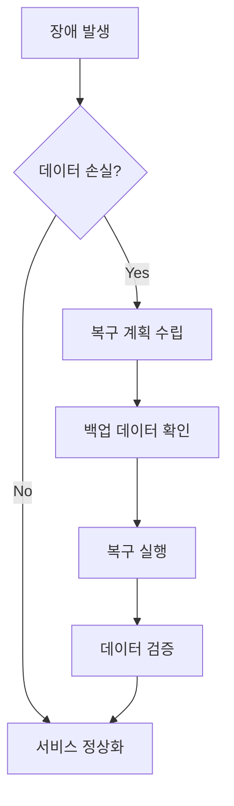

# 데이터 관리 정책

## 1. 데이터 보관 정책

### 1.1 데이터 유형별 보관 기간
```yaml
retention_periods:
  chat_history:
    active: "12개월"
    archive: "36개월"
    
  system_logs:
    active: "3개월"
    archive: "12개월"
    
  audit_logs:
    active: "6개월"
    archive: "60개월"
    
  analytics_data:
    raw: "3개월"
    aggregated: "24개월"
```

### 1.2 데이터 분류 기준
| 분류 | 중요도 | 보안등급 | 암호화 | 접근권한 |
|-----|--------|----------|--------|----------|
| 개인정보 | 높음 | S1 | 필수 | 제한적 |
| 업무데이터 | 중간 | S2 | 선택적 | 부서별 |
| 로그데이터 | 낮음 | S3 | 불필요 | 일반적 |

## 2. 백업 정책

### 2.1 백업 주기
```yaml
backup_schedule:
  full_backup:
    frequency: "주 1회"
    timing: "일요일 02:00"
    retention: "4주"
    
  incremental_backup:
    frequency: "일 1회"
    timing: "매일 03:00"
    retention: "2주"
    
  transaction_log_backup:
    frequency: "시간당"
    timing: "매시 정각"
    retention: "7일"
```

### 2.2 백업 대상
- 데이터베이스
- 설정 파일
- 사용자 데이터
- AI 모델 가중치
- 로그 파일

## 3. 복구 절차

### 3.1 복구 시나리오


### 3.2 복구 목표
- RTO (Recovery Time Objective): 4시간
- RPO (Recovery Point Objective): 1시간
- 데이터 정합성: 100%

## 4. 데이터 정제

### 4.1 정제 정책
```yaml
data_cleanup:
  chat_data:
    - remove_pii: true
    - compress_old_data: true
    - archive_threshold: "6개월"
    
  system_logs:
    - compress_logs: true
    - remove_debug_info: true
    - archive_threshold: "3개월"
```

### 4.2 아카이빙 전략
- 콜드 스토리지 활용
- 데이터 압축
- 접근 빈도 기반 계층화

## 5. 모니터링 및 감사

### 5.1 모니터링 항목
- 스토리지 사용량
- 백업 상태
- 데이터 접근 로그
- 성능 지표

### 5.2 감사 계획
```yaml
audit_schedule:
  - type: "데이터 접근 감사"
    frequency: "월 1회"
    
  - type: "백업 정합성 검사"
    frequency: "주 1회"
    
  - type: "보안 감사"
    frequency: "분기 1회"
``` 