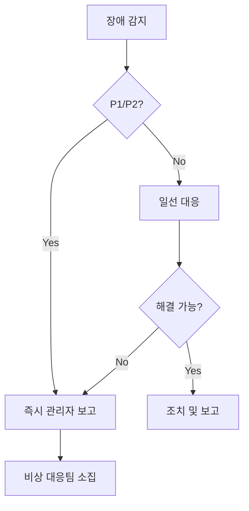

# 장애 대응 체계

## 1. 장애 등급 정의

### 1.1 장애 등급 분류
| 등급 | 심각도 | 영향도 | 대응시간 | 예시 |
|-----|--------|--------|----------|------|
| P1 | 긴급 | 서비스 중단 | 즉시 (15분 이내) | - 전체 서비스 중단<br>- 데이터 유실<br>- 보안 사고 |
| P2 | 높음 | 주요 기능 장애 | 30분 이내 | - AI 응답 불가<br>- 인증 시스템 장애 |
| P3 | 중간 | 부분 기능 장애 | 2시간 이내 | - 성능 저하<br>- 일부 기능 오류 |
| P4 | 낮음 | 경미한 문제 | 24시간 이내 | - UI 오류<br>- 비핵심 기능 문제 |

### 1.2 에스컬레이션 정책


## 2. 대응 프로세스

### 2.1 초기 대응
```yaml
initial_response:
  - step: "장애 감지 및 등급 판단"
    time: "5분 이내"
    action: "모니터링 알림 확인"
    
  - step: "상황 전파"
    time: "10분 이내"
    action: "관련 팀 통보"
    
  - step: "초기 조치"
    time: "15분 이내"
    action: "서비스 영향 최소화"
```

### 2.2 비상 연락망
```yaml
emergency_contacts:
  level1:
    - role: "시스템 운영자"
      contact: "010-XXXX-XXXX"
      backup: "010-YYYY-YYYY"
      
  level2:
    - role: "개발팀 리더"
      contact: "010-AAAA-AAAA"
      
  level3:
    - role: "IT 본부장"
      contact: "010-BBBB-BBBB"
```

## 3. 복구 프로세스

### 3.1 복구 절차
1. 장애 원인 파악
2. 복구 계획 수립
3. 복구 작업 실행
4. 서비스 정상화 확인
5. 모니터링 강화

### 3.2 복구 시나리오
```yaml
recovery_scenarios:
  - scenario: "데이터베이스 장애"
    steps:
      - "슬레이브 DB로 전환"
      - "마스터 DB 복구"
      - "데이터 정합성 검증"
      
  - scenario: "AI 모델 서버 장애"
    steps:
      - "백업 모델 서버 활성화"
      - "로드밸런서 설정 변경"
      - "장애 서버 복구"
```

## 4. 사후 관리

### 4.1 장애 보고서
```markdown
# 장애 보고서 템플릿

## 1. 장애 개요
- 발생일시:
- 복구일시:
- 장애등급:
- 영향범위:

## 2. 장애 내용
- 증상:
- 원인:
- 조치내용:

## 3. 재발방지 대책
- 단기 대책:
- 중장기 대책:
```

### 4.2 개선 계획
- 모니터링 강화
- 자동복구 방안 수립
- 운영자 교육
- 매뉴얼 개선 